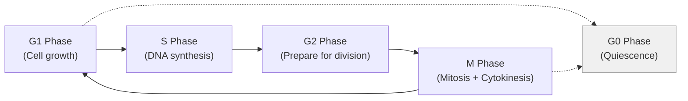
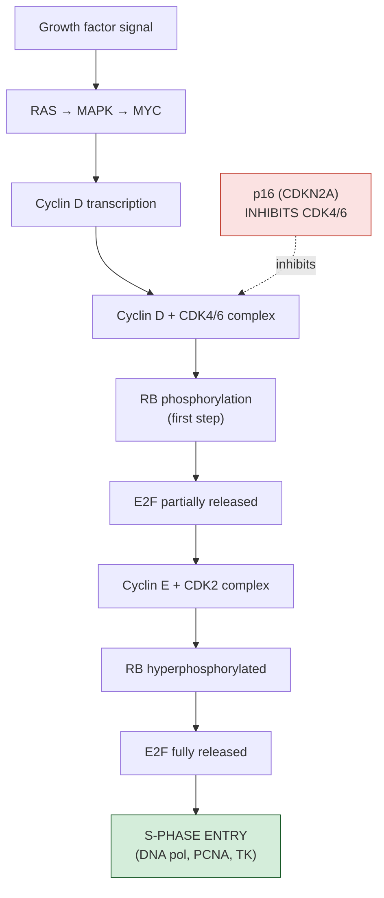
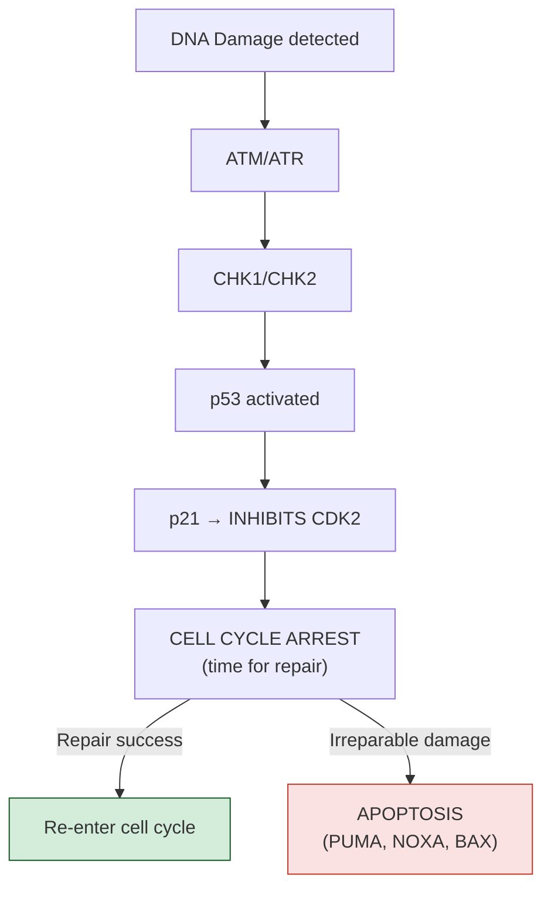

---
tags:
  - biology
  - cancer-biology
  - cell-cycle
  - cornell
aliases:
  - Cell Cycle
  - G1/S Checkpoint
  - CDK4/6
date: 2026-04-14
status: permanent
---
# Cell Cycle Deregulation

> [!ABSTRACT] Summary
> The cell cycle is controlled by cyclin-CDK complexes at defined checkpoints (G1/S, G2/M, Spindle Assembly). The G1/S checkpoint — the Restriction Point — is the most commonly disrupted in cancer, controlled by the p16–CDK4/6–RB–E2F axis. Almost ALL cancers disrupt this checkpoint through one of several mechanisms (CDKN2A deletion, CCND1 amplification, CDK4 amplification, RB1 loss, or HPV E7). The key insight: it doesn't matter HOW the circuit breaks — the result is the same: E2F is free → S-phase entry → uncontrolled proliferation.

---

## Cue Questions

> [!QUESTION] Key questions for self-testing
> - Draw the 4 phases of the cell cycle and name the key cyclin-CDK pair at each transition.
> - What is the Restriction Point, and why is it the most important checkpoint in cancer?
> - Explain the p16 → CDK4/6 → RB → E2F → S-phase axis.
> - What happens when DNA damage is detected at G1/S? (ATM/ATR → CHK → p53 → p21 → CDK2)
> - Name 5 different mechanisms that disrupt the RB pathway in cancer.
> - Why is the concept "many genes, one pathway" central to cancer biology?
> - What are CDK4/6 inhibitors, and under what condition do they fail?
> - What is the Spindle Assembly Checkpoint (SAC), and what happens when it fails?

---

## Notes

### 6.1 The Normal Cell Cycle



---

### 6.2 Cell Cycle Regulation — The Three Checkpoints

#### G1/S Checkpoint (The Restriction Point)

This is the most commonly disrupted checkpoint in cancer.



#### DNA Damage Response at G1/S



#### G2/M Checkpoint
- After S-phase: ATM/ATR → CHK1 → CDC25C phosphorylation → cytoplasmic retention
- Cannot activate CDK1 (CDC2) → Cyclin B-CDK1 NOT activated → NO M-phase entry

#### Spindle Assembly Checkpoint (SAC)
- Ensures all chromosomes properly attached to spindle
- Unattached kinetochores → MAD2/BUBR1 → Mitotic Checkpoint Complex → Inhibits APC/C
- Securin NOT degraded → Separase NOT activated → NO anaphase entry
- **If SAC defective → aneuploidy** (mis-segregated chromosomes)

---

### 6.3 Cell Cycle Deregulation in Cancer

> [!IMPORTANT] The Key Insight
> Almost ALL cancers disrupt the G1/S checkpoint. The mechanism varies, but the result is always the same: **E2F is free → S-phase entry → proliferation.**

**The RB Pathway Logic:**
```
Normal:    p16 ──┤ CDK4/6 ──┤ RB ──┤ E2F →→ cell division
           (inhibit)  (inhibit)  (inhibit)
```

**ONE of these disruptions is sufficient:**

| Mechanism | Cancer Type | Frequency |
|---|---|---|
| **CDKN2A (p16) deletion** | Pancreatic, glioma | ~50–80% |
| **CDKN2A methylation** | Various | ~20–40% |
| **CCND1 amplification** | Breast, HNSCC, MCL | ~15–30% |
| **CDK4 amplification** | Liposarcoma, glioma | ~10–20% |
| **CDK6 amplification** | Glioblastoma, sarcoma | ~5–15% |
| **RB1 mutation/deletion** | Retinoblastoma, SCLC | ~5–100% |
| **HPV E7 (RB inactivation)** | Cervical, oropharynx | ~90%+ |

> [!WARNING] CDK4/6 Inhibitors Require Intact RB
> CDK4/6 inhibitors (palbociclib, ribociclib, abemaciclib) work regardless of the specific disruption mechanism — **as long as RB is intact.** If RB is lost, they won't work.

---

## Summary

> [!TIP] Cornell Summary
> The cell cycle has three main checkpoints (G1/S, G2/M, SAC), with G1/S being the most cancer-relevant. The p16–CDK4/6–RB–E2F axis gates S-phase entry. DNA damage triggers ATM/ATR → p53 → p21 → arrest or apoptosis. Cancer disrupts this circuit through 7+ different mechanisms (p16 loss, Cyclin D amplification, CDK4 amplification, RB loss, HPV E7), but the outcome is always the same: E2F release → uncontrolled proliferation. This "many genes, one pathway" concept is fundamental — and CDK4/6 inhibitors exploit it therapeutically (only when RB is intact).

---

## Related

- [[Cancer Biology Reference Index]]
- [[Oncogenes and Tumor Suppressors]]
- [[Hallmarks of Cancer]]
- [[Signal Transduction in Cancer]]
- [[Cancer Biology MOC]]
