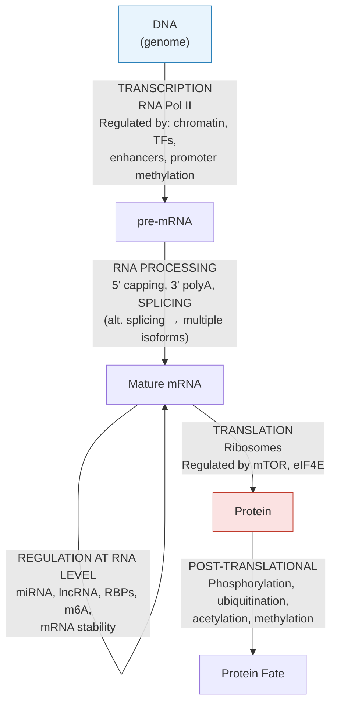

---
tags:
  - biology
  - cancer-biology
  - molecular-biology
  - cornell
aliases:
  - Central Dogma
  - Gene Regulation
date: 2026-04-14
status: permanent
---
# DNA, Genes, and the Central Dogma

> [!ABSTRACT] Summary
> The human genome encodes ~20,000 protein-coding genes in only ~1–2% of its 3.2 billion base pairs. Cancer is fundamentally a disease of dysregulated gene expression, operating through disruptions at every layer: chromatin accessibility, transcriptional regulation, RNA processing, translation, and post-translational modification. Mutations frequently occur in non-coding regulatory elements, not just in genes themselves.

---

## Cue Questions

> [!QUESTION] Key questions for self-testing
> - What fraction of the genome is protein-coding, and where do cancer mutations often occur?
> - What are the steps of the expanded central dogma?
> - Name three layers of gene regulation and one cancer-relevant disruption at each.
> - What is a super-enhancer, and why is it relevant to oncogene expression?
> - How can splicing factor mutations contribute to cancer?
> - What is the difference between euchromatin and heterochromatin?
> - Why are SWI/SNF chromatin remodelers important in cancer (~20% of all cancers)?

---

## Notes

### 2.1 Genome Organization

The human genome: ~3.2 billion base pairs, 23 chromosome pairs (46 total: 22 autosome pairs + 1 sex chromosome pair).

| Genome Fraction | Content | Cancer Relevance |
|---|---|---|
| **~1–2%** | Protein-coding genes (~20,000 genes, exons) | Driver mutations in coding regions |
| **~25–30%** | Introns + regulatory sequences (promoters, enhancers, silencers, insulators) | Enhancer hijacking, promoter mutations |
| **~50–60%** | Repetitive sequences (LINEs, SINEs/Alu, satellite DNA, telomeres, endogenous retroviruses) | Retrotransposition, genomic instability |
| **~5–10%** | Non-coding RNAs: miRNAs (~2,000), lncRNAs (~60,000+), circRNAs, piRNAs, snoRNAs | miRNA dysregulation, lncRNA in oncogenesis |

> [!NOTE] "Junk DNA" is a misnomer
> Much of the non-coding genome has regulatory functions. Cancer-associated mutations frequently occur in non-coding regulatory elements.

---

### 2.2 The Central Dogma — Expanded

#### Cancer-Relevant Disruptions at Each Step

| Step | Normal Role | Cancer Disruption |
|---|---|---|
| **Transcription** | Controlled gene expression | Enhancer hijacking, super-enhancer formation driving oncogenes |
| **Splicing** | Intron removal, exon joining | Splicing factor mutations (SF3B1, U2AF1) in myeloid cancers; exon skipping, intron retention |
| **RNA regulation** | miRNA-mediated post-transcriptional control | miR-21, miR-155 are oncomiRs; let-7 is tumor-suppressive |
| **Translation** | Controlled protein synthesis | mTOR signaling hyperactivation; eIF4E amplification |
| **Post-translational** | Protein modification and fate | MDM2/p53 ubiquitination axis; HSP90 chaperone cancer dependency |

---

### 2.3 Gene Regulation — The Layers

#### Layer 1: Chromatin Accessibility

| State | Mechanism | Gene Status |
|---|---|---|
| **Heterochromatin** (closed) | DNA wrapped tightly around histones, TFs cannot bind | Gene **OFF** |
| **Euchromatin** (open) | Nucleosomes spaced apart, DNA accessible | Gene can be **ON** |

**Controllers:**
- *H3K27ac* (histone acetylation) → **open**
- *H3K27me3* (histone methylation) → **closed**
- ATP-dependent chromatin remodelers (**SWI/SNF** — mutated in ~20% of cancers)
- DNA methylation at CpG islands

#### Layer 2: Transcriptional Regulation

| Element | Location | Function | Cancer Relevance |
|---|---|---|---|
| **Promoter** | ~1kb upstream of TSS | Core promoter (TATA box, initiator) + proximal elements | Promoter mutations (e.g., TERT C228T) |
| **Enhancers** | Can be millions of bp away | Loop to promoter via mediator complex; tissue-specific expression | Super-enhancers drive oncogene expression |
| **Silencers / Insulators** | Boundary elements | CTCF protein marks TAD boundaries | TAD disruption brings enhancers near oncogenes (e.g., TAL1 in T-ALL) |

> [!IMPORTANT] Topologically Associating Domains (TADs)
> TADs organize chromatin into loops. TAD disruption in cancer can bring enhancers near oncogenes — this is called **enhancer hijacking**.

#### Layer 3: Epigenetic Memory

| System | Mechanism | Cancer Example |
|---|---|---|
| **PRC2 (Polycomb)** | EZH2 deposits H3K27me3 → gene silencing | EZH2 gain-of-function in lymphoma (silences tumor suppressors); EZH2 inhibitors FDA-approved |
| **DNA methylation** | CpG island hypermethylation silences genes without mutation | CIMP in glioma/CRC; DNMT3A mutations in AML |
| **Demethylation** | TET enzymes (TET1/2/3) remove methylation | TET2 mutations in myeloid neoplasms; IDH1/2 mutations → 2-HG inhibits TET2 |

---

## Summary

> [!TIP] Cornell Summary
> The genome is far more than protein-coding genes — regulatory regions, non-coding RNAs, and epigenetic marks all play cancer-relevant roles. Gene expression is controlled at multiple layers: chromatin accessibility (SWI/SNF remodelers, histone marks), transcription (enhancers, super-enhancers, TADs), RNA processing (alternative splicing), and post-transcriptional regulation (miRNAs). Cancer exploits disruptions at every layer, often without mutating the gene itself (e.g., promoter methylation, enhancer hijacking). Understanding these layers is essential for interpreting spatial transcriptomics data.

---

## Related

- [[Cancer Biology Reference Index]]
- [[The Cell - Molecular Architecture]]
- [[Mutations and Genomic Alterations]]
- [[Epigenetics in Cancer]]
- [[Cancer Biology MOC]]
