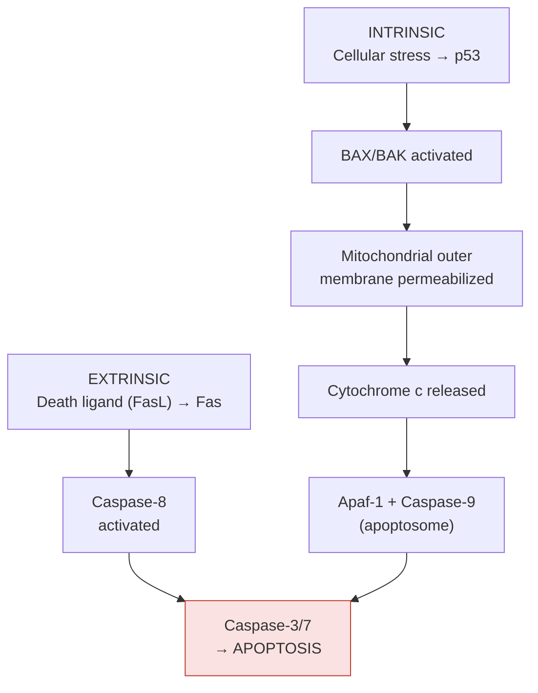
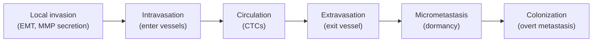

---
tags:
  - biology
  - cancer-biology
  - hallmarks
  - cornell
aliases:
  - Hanahan Weinberg
  - Cancer Hallmarks
date: 2026-04-14
status: permanent
---
# The Hallmarks of Cancer

> [!ABSTRACT] Summary
> Hanahan & Weinberg defined the organizing framework of cancer biology: 8 hallmarks (sustained proliferative signaling, evading growth suppressors, resisting cell death, replicative immortality, inducing angiogenesis, activating invasion & metastasis, reprogramming energy metabolism, evading immune destruction) plus 2 enabling characteristics (genome instability and tumor-promoting inflammation). Each hallmark has specific molecular mechanisms and characteristic H&E appearances relevant to computational pathology.

---

## Cue Questions

> [!QUESTION] Key questions for self-testing
> - Name all 8 hallmarks of cancer and the 2 enabling characteristics.
> - What are the 4 strategies cancer uses for sustained proliferative signaling?
> - Name 3 mechanisms of resisting cell death beyond apoptosis evasion (necroptosis, pyroptosis, ferroptosis).
> - What is the Hayflick limit, and how do 90% of cancers overcome it (telomerase) vs. 10% (ALT)?
> - What is the angiogenic switch, and why are tumor blood vessels abnormal?
> - What is EMT, and why are hybrid/partial EMT states the most metastatic?
> - What is Paget's "seed and soil" hypothesis?
> - What are the H&E features of each hallmark?
> - What is the difference between CIN and MSI as sources of genomic instability?

---

## Notes

### 5.1 The Original Six Hallmarks (Hanahan & Weinberg, 2000)

#### Hallmark 1: Sustained Proliferative Signaling

**Normal:** Growth factor → receptor → signal cascade → controlled division → signal terminates

**Cancer strategies:**

| Strategy | Example | Mechanism |
|---|---|---|
| Autocrine signaling | Tumor makes TGF-α → stimulates its own EGFR | Self-sustaining |
| Constitutive receptor activation | EGFR L858R (lung), HER2 amplification, FLT3-ITD (AML) | Always-on signaling |
| Downstream pathway activation | RAS mutations, BRAF V600E | Signaling without receptor input |
| Ligand-independent dimerization | EML4-ALK fusion (lung) | Always dimerized |

> [!TIP] H&E Appearance
> Hypercellularity, increased mitotic figures, high nuclear:cytoplasmic ratio.

---

#### Hallmark 2: Evading Growth Suppressors

**Normal:** Contact inhibition, TGF-β signaling, Hippo pathway, p16/RB checkpoint

**Cancer strategies:**

| Strategy | Mechanism | Example |
|---|---|---|
| RB pathway disruption | CDKN2A deletion, CCND1 amplification, RB1 mutation, HPV E7 | Most common — see [[Cell Cycle Deregulation]] |
| TGF-β pathway inactivation | TGFBR2 mutation (MSI-H cancers), SMAD4 loss (pancreatic, CRC) | Note: TGF-β has dual roles — early suppressive, late tumor-promoting |
| Hippo pathway inactivation | NF2 (Merlin) loss → YAP/TAZ nuclear translocation | Mesothelioma, schwannoma |
| Contact inhibition loss | NF2/LATS1/2 inactivation | Cells grow despite neighbors |

---

#### Hallmark 3: Resisting Cell Death

**Two apoptosis pathways:**

**Cancer evasion strategies:**
- **BCL2 overexpression** — t(14;18) in follicular lymphoma → blocks MOMP
- **TP53 mutation** → no PUMA/NOXA/BAX → intrinsic pathway blocked
- **FLIP overexpression** → blocks caspase-8 → extrinsic blocked
- **IAP family** (XIAP, cIAP1/2) → block caspases directly
- **Fas receptor downregulation** → immune cells can't trigger death

**Non-apoptotic cell death forms:**
- *Necroptosis:* RIPK1/RIPK3/MLKL-mediated → inflammatory
- *Pyroptosis:* Gasdermin-mediated → inflammatory
- *Ferroptosis:* Iron-dependent lipid peroxidation → GPX4 is the key enzyme; some tumors are ferroptosis-sensitive
- *Autophagic cell death:* excessive self-digestion

> [!TIP] H&E Appearance
> Few apoptotic bodies (normal tissue has more). Paradoxically: necrosis in tumor centers (outgrowing blood supply, but individual cells resist apoptosis).

---

#### Hallmark 4: Replicative Immortality

**Telomere biology:**
- Telomere structure: 5'-TTAGGG repeats, bound by shelterin complex (TRF1, TRF2, POT1, TIN2, TPP1, RAP1)
- **End replication problem:** DNA polymerase can't replicate the 3' end → telomere shortens 50–200 bp per division
- **Hayflick Limit:** ~50–70 divisions for fibroblasts → critically short telomeres → senescence or crisis

**Cancer solutions:**

| Mechanism | Frequency | Details |
|---|---|---|
| **Telomerase reactivation (TERT)** | ~90% of cancers | TERT promoter mutations (C228T, C250T); MYC directly activates TERT transcription |
| **Alternative Lengthening of Telomeres (ALT)** | ~10% of cancers | HR-based telomere extension; ATRX/DAXX mutations; more common in sarcomas |

---

#### Hallmark 5: Inducing Angiogenesis

**Angiogenic switch:** Tumor grows to ~1–2mm → oxygen diffusion limit → HIF-1α stabilized → VEGF → new vessels

| Pro-angiogenic | Anti-angiogenic |
|---|---|
| VEGF-A, -B, -C, -D | Thrombospondin-1 (TSP1) |
| FGF, PDGF, HGF | Endostatin, Angiostatin |
| Angiopoietin-2, IL-8 | Tumstatin, Vasohibin |

**Tumor vessels are ABNORMAL:** Irregular diameter, excessive branching, leaky (pericyte-deficient), chaotic blood flow → regions of hypoxia → poor drug delivery

**Anti-angiogenic therapy:** Bevacizumab (anti-VEGF-A), sunitinib, sorafenib. Problem: resistance via alternative pathways, vessel co-option, vascular mimicry.

> [!TIP] H&E Appearance
> Microvessel density, glomeruloid microvascular proliferation (glioblastoma), hemorrhage, geographic necrosis.

---

#### Hallmark 6: Activating Invasion & Metastasis

**The metastatic cascade:**

**Epithelial-Mesenchymal Transition (EMT):**

| Epithelial State | → EMT → | Mesenchymal State |
|---|---|---|
| E-cadherin (+) | | N-cadherin (+) |
| Cytokeratins (+) | | Vimentin (+) |
| Polarity (+) | | Fibronectin (+) |
| Immobile | | Motile, invasive |

**EMT Transcription Factors:** SNAIL, SLUG, TWIST1/2, ZEB1/2
**EMT Inducers:** TGF-β (major), Wnt/β-catenin, Notch, hypoxia, inflammatory cytokines

> [!IMPORTANT] EMT is a Spectrum, Not Binary
> Hybrid/partial EMT states have the **most metastatic potential.** Collective migration of cell groups with partial EMT. Relevant for segmentation: produces cells with intermediate morphology.

**Seed and Soil (Paget's hypothesis):** Metastasis is not random.
- Breast → bone, brain, liver, lung
- Colon → liver (portal circulation)
- Prostate → bone (osteoblastic)
- Melanoma → brain, lung, liver

**Pre-metastatic niche:** Primary tumor sends exosomes and BMDPs to condition distant sites before metastatic cells arrive.

> [!TIP] H&E Appearance
> Invasive front (irregular clusters breaking away), lymphovascular invasion, perineural invasion, metastatic deposits in lymph nodes/organs.

---

### 5.2 Emerging Hallmarks (Hanahan & Weinberg, 2011)

| Hallmark | Details |
|---|---|
| **Hallmark 7: Reprogramming Energy Metabolism** | Warburg effect — see [[Cancer Metabolism]] |
| **Hallmark 8: Evading Immune Destruction** | Checkpoint exploitation — see [[Immune Evasion and Immunology]] |

---

### 5.3 Enabling Characteristics

#### Enabling 1: Genome Instability & Mutation

| Source | Mechanism | Consequence |
|---|---|---|
| **DNA repair deficiency** | MMR → MSI (10–100x mutation rate); HR → rearrangements; NER → UV mutagenesis | See [[Mutations and Genomic Alterations]] |
| **Chromosomal instability (CIN)** | Centrosome amplification, spindle checkpoint defects (BUB1, MAD2), cohesin mutations (STAG2) | Aneuploidy, CNV, LOH |
| **Replication stress** | Oncogene activation (MYC, RAS) → premature S-phase → fork collapse | DSBs, rearrangements at fragile sites |
| **Telomere crisis** | Critically short telomeres → fusions → BFB cycles → chromothripsis | Amplifications, catastrophic rearrangements |
| **Mutator phenotype** | POLE/POLD1 proofreading mutations → ultra-hypermutated (>100 mut/Mb) | Highly immunogenic → respond to immunotherapy |

#### Enabling 2: Tumor-Promoting Inflammation

**Anti-tumor:** Th1 CD4+ T cells, CD8+ CTLs, M1 macrophages, NK cells, Type I interferons
**Pro-tumor:** NF-κB, STAT3, PGE₂, IL-6, IL-1β, M2 macrophages, MDSCs, Th17, ROS → DNA damage

**Inflammation → Cancer examples:** H. pylori → gastric; IBD → CRC; Hep B/C → HCC; HPV → cervical; chronic pancreatitis → pancreatic

> [!TIP] H&E Appearance
> Inflammatory infiltrates, granulation tissue, desmoplasia (fibrotic stroma from chronic inflammation).

---

## Summary

> [!TIP] Cornell Summary
> The 8 hallmarks provide a comprehensive framework for cancer biology: tumors sustain proliferation, evade growth suppressors, resist death, achieve immortality, induce angiogenesis, activate invasion/metastasis, reprogram metabolism, and evade immunity. Two enabling characteristics (genomic instability and inflammation) underpin these hallmarks. Each hallmark has characteristic H&E features — from hypercellularity and mitotic figures (proliferation) to desmoplasia (inflammation) to invasive fronts (metastasis). For computational pathology, the hallmarks guide feature extraction: mitotic detection, architectural pattern recognition, immune phenotyping, and spatial TME analysis.

---

## Related

- [[Cancer Biology Reference Index]]
- [[Oncogenes and Tumor Suppressors]]
- [[Cell Cycle Deregulation]]
- [[Immune Evasion and Immunology]]
- [[Cancer Metabolism]]
- [[Angiogenesis and Metastasis]]
- [[Tumor Microenvironment]]
- [[Cancer Biology MOC]]
