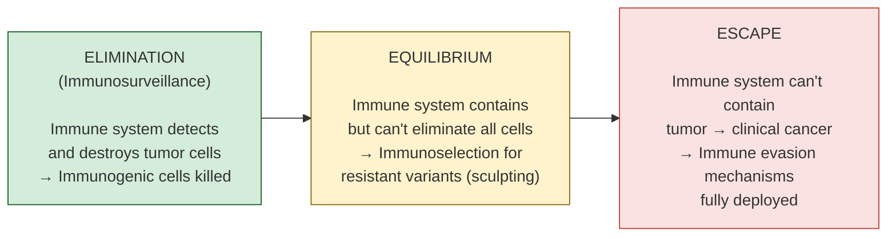

---
tags:
  - biology
  - cancer-biology
  - immunology
  - immunotherapy
  - cornell
aliases:
  - Immunoediting
  - Checkpoint Inhibitors
  - PD-1/PD-L1
  - CTLA-4
  - Immune Phenotypes
date: 2026-04-14
status: permanent
---
# Immune Evasion and Immunology

> [!ABSTRACT] Summary
> The immune system eliminates most nascent tumors through immunosurveillance, but cancer cells that survive undergo immunoediting — a three-phase process (Elimination → Equilibrium → Escape). Escaped tumors deploy multiple evasion strategies: immune checkpoint exploitation (PD-1/PD-L1, CTLA-4), MHC-I downregulation, antigen loss, immunosuppressive cells (Tregs, M2 TAMs, MDSCs), immunosuppressive metabolites (IDO, adenosine, lactate), and physical barriers (desmoplasia). Tumors fall into three immune phenotypes — inflamed (hot), excluded, and desert (cold) — which dictate response to immunotherapy and are directly assessable by computational pathology.

---

## Cue Questions

> [!QUESTION] Key questions for self-testing
> - What are the 3 Es of cancer immunoediting?
> - Explain the PD-1/PD-L1 axis: what happens when a tumor upregulates PD-L1?
> - What is the difference between constitutive and adaptive PD-L1 expression?
> - What is CTLA-4, and why does it outcompete CD28?
> - Name 3 mechanisms of MHC-I downregulation and why NK cells partially compensate.
> - What are the 5 categories of immune evasion mechanisms?
> - What are the 3 tumor immune phenotypes (inflamed, excluded, desert)?
> - Why is the immune-excluded phenotype the most important for spatial analysis?
> - Which phenotype responds best to checkpoint inhibitors?
> - How does IDO deplete tryptophan, and what effect does this have on T cells?
> - Why does desmoplasia create an "immune desert"?
> - What determines whether a tumor will respond to anti-PD-1?

---

## Notes

### 11.1 Cancer Immunoediting — The Three Es

---

### 11.2 Immune Evasion Mechanisms — The 7 Strategies

#### 1. Immune Checkpoint Exploitation

##### PD-1/PD-L1 Axis

| Component | Location | Role |
|---|---|---|
| **PD-L1** (B7-H1) | Tumor cell surface | Sends inhibitory signal |
| **PD-1** (CD279) | T cell surface | Receives signal → T cell exhaustion |

**PD-L1 upregulation mechanisms:**
- **Constitutive:** PTEN loss → PI3K/AKT → PD-L1
- **Adaptive:** IFN-γ from T cells → tumor senses immune attack → puts up shield
- **Oncogene-driven:** EGFR, ALK mutations → PD-L1

**Therapies:**
- Anti-PD-1: pembrolizumab, nivolumab, cemiplimab
- Anti-PD-L1: atezolizumab, durvalumab, avelumab

##### CTLA-4 Axis

| Component | Location | Role |
|---|---|---|
| **B7-1/B7-2** (CD80/86) | APC surface | Co-stimulatory ligand |
| **CD28** | T cell surface | Stimulatory receptor |
| **CTLA-4** | T cell surface | Inhibitory receptor (higher affinity than CD28 → outcompetes) |

- CTLA-4 inhibits T cell **priming** in the lymph node (earlier than PD-1)
- Tregs constitutively express CTLA-4 → suppressive
- **Therapy:** Ipilimumab (first checkpoint inhibitor), tremelimumab

---

#### 2. MHC Class I Downregulation

| Mechanism | Gene | Effect |
|---|---|---|
| B2M mutation | *B2M* | β2-microglobulin loss → MHC-I not stable |
| TAP1/2 downregulation | *TAP1/TAP2* | Transporter for antigen processing lost |
| NLRC5 silencing | *NLRC5* | Master regulator of MHC-I silenced |
| HLA LOH | *HLA* | One HLA haplotype lost |
| Epigenetic silencing | Various | Antigen processing genes silenced |

**Consequence:** Invisible to CD8+ T cells
**Counter:** NK cells detect "missing self" → kill MHC-low cells
**Tumor counter-counter:** Upregulate HLA-E/G (non-classical MHC) → inhibit NK cells via NKG2A

---

#### 3. Antigen Loss
- Tumor stops expressing the recognized antigen (immunoediting)
- T cells kill antigen-positive cells → only negative cells survive
- Defective antigen processing → altered peptide repertoire

#### 4. Immunosuppressive Cells
- **Tregs** (FOXP3+CD25+): CTLA-4, IL-10, TGF-β, adenosine pathway (CD39/CD73)
- **M2 macrophages/TAMs**: promote angiogenesis, remodel matrix, suppress T cells
- **MDSCs**: arginase-1 (deplete arginine), iNOS (NO), ROS
- **Tolerogenic DCs**: induce T cell anergy
- **Regulatory B cells (Bregs)**: IL-10, TGF-β

#### 5. Immunosuppressive Metabolites

| Metabolite | Source | Effect on Immune Cells |
|---|---|---|
| **Kynurenine** | IDO (tumor/DCs) | Tryptophan depletion → GCN2 activation → T cell anergy |
| **Adenosine** | CD39/CD73 (Tregs, tumor) | A2A receptor → T cell suppression |
| **Arginine depletion** | Arginase (MDSCs, TAMs) | CD3ζ chain downregulation → T cell dysfunction |
| **Lactate** | Warburg effect | Acidifies TME → inhibits T cells and NK cells → M2 polarization |
| **PGE₂** | COX-2 | Immune suppression, angiogenesis |

#### 6. Physical Barriers
- Dense ECM (desmoplasia) → T cells can't physically infiltrate (pancreatic cancer = "immune desert")
- Abnormal vasculature → poor T cell trafficking
- Immune-excluded phenotype: T cells at periphery but barrier prevents core infiltration

#### 7. Emerging Checkpoints
LAG-3, TIM-3, TIGIT, VISTA, B7-H3, B7-H4 — all being investigated as therapeutic targets. Combination checkpoint blockade is a major clinical direction.

---

### 11.3 Tumor Immune Phenotypes (Critical for Computational Pathology)

| Phenotype | TIL Pattern | Key Features | Immunotherapy Response | H&E Appearance |
|---|---|---|---|---|
| **Immune-Inflamed** ("Hot") | T cells diffusely infiltrating throughout tumor | PD-L1 often positive, IFN-γ signature | **Best response** to checkpoint inhibitors | Lymphocytes scattered within tumor cell nests |
| **Immune-Excluded** | T cells at periphery/stroma but not in tumor core | CAF-enriched stroma, TGF-β signaling, physical barrier | Checkpoint inhibitors may not work alone | Lymphocytes ring the tumor but don't penetrate nests |
| **Immune-Desert** ("Cold") | Few or no T cells anywhere | Low neoantigen burden, MHC-I loss, Wnt/β-catenin activation | Generally ineffective → needs vaccines, adoptive cell therapy | Sparse inflammatory infiltrate throughout |

> [!IMPORTANT] Relevance to Your Research
> - **Whole-cell segmentation + cell typing** → classify immune phenotype automatically
> - **Spatial distribution of immune cells** → inflamed vs. excluded vs. desert
> - **Spatial transcriptomics** → immune gene signatures in specific regions
> - The **immune-excluded phenotype** is where spatial analysis is most critical: H&E alone can't always distinguish excluded from inflamed without quantitative spatial measurement
> - This has **direct clinical implications** for treatment selection

---

## Summary

> [!TIP] Cornell Summary
> Cancer immunoediting (Elimination → Equilibrium → Escape) explains how tumors evolve to evade immunity. Escape mechanisms include checkpoint exploitation (PD-1/PD-L1, CTLA-4), MHC-I loss, antigen loss, immunosuppressive cells (Tregs, TAMs, MDSCs), metabolic suppression (IDO, adenosine, lactate), and physical barriers (desmoplasia). Tumors are classified into three immune phenotypes: inflamed (responds to immunotherapy), excluded (spatial analysis critical), and desert (needs combinatorial approaches). Computational pathology can automate immune phenotyping from H&E and spatial transcriptomics, with direct impact on treatment selection.

---

## Related

- [[Cancer Biology Reference Index]]
- [[Hallmarks of Cancer]]
- [[Tumor Microenvironment]]
- [[Spatial Biology and Computational Pathology]]
- [[Histopathology and H&E Interpretation]]
- [[Cancer Biology MOC]]
