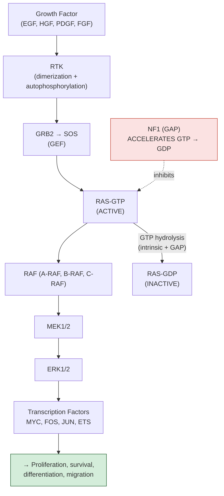
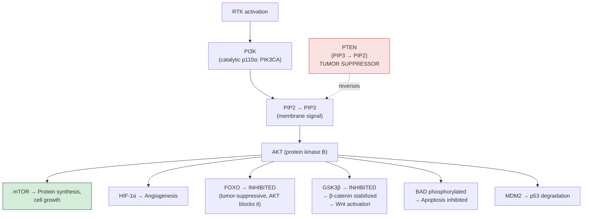

---
tags:
  - biology
  - cancer-biology
  - signaling
  - pathways
  - cornell
aliases:
  - RAS-MAPK
  - PI3K-AKT-mTOR
  - Wnt Pathway
  - Notch Pathway
date: 2026-04-14
status: permanent
---
# Signal Transduction in Cancer

> [!ABSTRACT] Summary
> Cancer signaling is dominated by a handful of pathways that are recurrently mutated. The two most important are **RTK–RAS–MAPK** (cell proliferation, the most frequently mutated pathway in cancer) and **PI3K–AKT–mTOR** (cell survival). Additional drivers include Wnt/β-catenin, Notch, Hedgehog, TGF-β, and JAK-STAT. Each pathway has its own negative regulators (brakes), and cancer commonly removes these brakes rather than just pressing the accelerator.

---

## Cue Questions

> [!QUESTION] Key questions for self-testing
> - Draw the RTK → RAS → RAF → MEK → ERK signaling cascade.
> - What are the 3 RAS genes, and which cancers harbor each?
> - What is BRAF V600E, and what targeted therapies exist?
> - Why are negative feedback regulators (NF1, PTEN, SOCS) just as important as the pathway itself?
> - Draw the PI3K → PIP3 → AKT → mTOR cascade and identify where PTEN acts.
> - What does AKT activate and inhibit? (mTOR, HIF-1α, FOXO, GSK3β, BAD, MDM2)
> - What happens in the Wnt pathway when APC is mutated?
> - How is the Notch pathway context-dependent (oncogenic in T-ALL, suppressive in squamous)?
> - What is the TGF-β paradox (early tumor-suppressive, late tumor-promoting)?

---

## Notes

### 7.1 RTK–RAS–MAPK Pathway

The most frequently mutated pathway in cancer.

**RAS Mutations in Cancer:**

| Gene | Major Mutation | Cancer Types |
|---|---|---|
| **KRAS** | G12D, G12V, **G12C** | Pancreatic (90%), CRC (45%), lung adeno (30%) |
| **NRAS** | Q61R/K | Melanoma (20%), AML (10–15%) |
| **HRAS** | G12V | Bladder, thyroid (rare) |

**Targeted therapies:**
- **BRAF V600E** → vemurafenib, dabrafenib (often + MEK inhibitor trametinib)
- **KRAS G12C** → sotorasib, adagrasib
- **MEK inhibitors** → trametinib, selumetinib, cobimetinib
- **NF1 loss** → MEK inhibitors may be effective

**Key negative regulators:**
- NF1 (GAP for RAS) — neurofibromatosis type 1
- SPRY (Sprouty) — inhibits RAS-RAF signaling
- DUSP proteins — dephosphorylate ERK

---

### 7.2 PI3K–AKT–mTOR Pathway

The major cell survival pathway.

**Cancer-relevant mutations:**

| Gene | Alteration | Cancer Types |
|---|---|---|
| **PIK3CA** | E545K, H1047R (activating) | Breast (40%), endometrial, CRC |
| **PTEN** | Deletion/mutation (loss) | Endometrial (50–80%), GBM (30–40%), prostate |
| **AKT1** | E17K (activating) | Breast, endometrial |
| **mTOR** | Activating mutations | Renal cell carcinoma |

**Targeted therapies:**
- mTOR inhibitors: everolimus, temsirolimus
- PI3Kα inhibitor: alpelisib (breast cancer)

---

### 7.3 JAK-STAT Pathway

| Downstream Target | Effect |
|---|---|
| **STAT3** | Survival, proliferation, immune evasion |
| **STAT5** | Hematopoietic growth |
| **SOCS** | Suppressor of cytokine signaling = negative feedback brake |

---

### 7.4 Wnt/β-Catenin Pathway

**OFF state:** β-catenin bound by destruction complex (APC + Axin + GSK3β + CK1) → phosphorylated → ubiquitinated by β-TrCP → proteasomal degradation

**ON state:** Wnt → Frizzled/LRP → Dishevelled → inhibits destruction complex → β-catenin accumulates → enters nucleus → TCF/LEF → transcription of MYC, Cyclin D1, AXIN2, LGR5 (stem cell genes)

| Mutation | Consequence | Cancer |
|---|---|---|
| **APC mutation** | Destruction complex non-functional → constitutive Wnt | Colorectal (>80%) |
| **CTNNB1 mutation** | β-catenin stabilization (cannot be degraded) | Hepatocellular, endometrial |
| **RNF43 mutation** | Membrane receptor regulation lost | Pancreatic mucinous neoplasms |

---

### 7.5 Notch Pathway

Notch receptor + ligand (Jagged/Delta) on neighboring cell → cleavage (ADAM + γ-secretase) → NICD released → enters nucleus → RBP-Jκ → transcription of HES, HEY genes

> [!WARNING] Context-Dependent Role
> - **Oncogenic** in T-ALL: NOTCH1 activating mutations
> - **Tumor-suppressive** in squamous cancers: NOTCH loss-of-function mutations

---

### 7.6 Hedgehog Pathway

Hedgehog ligand → PTCH1 releases SMO → GLI transcription factors

| Mutation | Cancer | Therapy |
|---|---|---|
| **PTCH1 loss** or **SMO gain** | Basal cell carcinoma, medulloblastoma | SMO inhibitors: vismodegib, sonidegib |

---

### 7.7 TGF-β Pathway (Dual Role)

TGF-β → TGFBR2 → TGFBR1 → SMAD2/3 phosphorylation → SMAD2/3 + SMAD4 → nucleus → transcription

> [!IMPORTANT] The TGF-β Paradox
> - **Early:** Tumor-suppressive (cell cycle arrest via p15, p21)
> - **Late:** Tumor-promoting (EMT, immune evasion, metastasis)
> - **SMAD4 loss** in pancreatic/colorectal cancer → tumor-suppressive arm lost, but alternative signaling still promotes EMT

---

## Summary

> [!TIP] Cornell Summary
> Two signaling highways dominate cancer: **RTK–RAS–MAPK** (growth/proliferation, mutated in majority of cancers — KRAS, BRAF V600E) and **PI3K–AKT–mTOR** (survival/growth, braked by PTEN). Additional important pathways include Wnt/β-catenin (APC loss → colorectal), Notch (context-dependent), Hedgehog (BCC, medulloblastoma), and TGF-β (dual: early suppressive, late promoting). Every pathway has negative regulators (NF1, PTEN, SOCS, APC) that are just as important as the activators. Targeted therapies are available for several nodes (imatinib, vemurafenib+trametinib, sotorasib, alpelisib, everolimus, vismodegib).

---

## Related

- [[Cancer Biology Reference Index]]
- [[Oncogenes and Tumor Suppressors]]
- [[Cell Cycle Deregulation]]
- [[Hallmarks of Cancer]]
- [[Cancer Biology MOC]]
