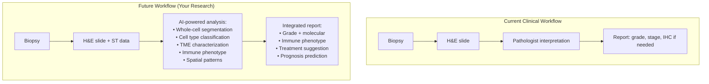

---
tags:
  - biology
  - cancer-biology
  - spatial-transcriptomics
  - computational-pathology
  - cornell
aliases:
  - Spatial Transcriptomics
  - Virtual Staining
  - Cell Segmentation
date: 2026-04-14
status: permanent
---
# Spatial Biology and Computational Pathology

> [!ABSTRACT] Summary
> Spatial transcriptomics technologies measure gene expression while preserving tissue location, bridging the gap between morphology (H&E) and molecular identity (transcriptome). Two technology families exist: sequencing-based (Visium, Slide-seq, Stereo-seq — whole transcriptome, lower resolution) and imaging-based (MERFISH, Xenium, CosMx — targeted panels, subcellular resolution). Cell segmentation from spatial data is a critical computational challenge — and where H&E-informed approaches excel by combining morphology with molecular identity. The ultimate clinical goal: predict molecular features from routine H&E slides ("virtual transcriptomics").

---

## Cue Questions

> [!QUESTION] Key questions for self-testing
> - Name 3 sequencing-based and 3 imaging-based spatial transcriptomics technologies.
> - What are the trade-offs between sequencing-based (unbiased, lower resolution) and imaging-based (targeted, subcellular)?
> - Why is cell segmentation the critical bottleneck in spatial transcriptomics analysis?
> - Name 5 approaches to cell segmentation in spatial data (nuclei-based, membrane, transcript-based, H&E-informed, multi-modal).
> - What is the advantage of H&E-informed segmentation over expansion-only approaches?
> - What is "virtual transcriptomics" / "virtual staining", and why is it clinically valuable?
> - What is the spatial analysis pipeline (preprocessing → segmentation → annotation → spatial analysis → integration)?
> - Name 3 spatial analysis methods (neighborhood analysis, ligand-receptor, spatial domains).
> - How does your research bridge H&E morphology and spatial transcriptomics?

---

## Notes

### 16.1 Spatial Transcriptomics Technologies

#### Sequencing-Based (Unbiased, Lower Resolution)

| Technology | Resolution | Coverage | Tissue Area | Method |
|---|---|---|---|---|
| **10x Visium** | 55μm spots (1–10 cells) | Whole transcriptome | 6.5×6.5mm | Barcoded spots on glass |
| **10x Visium HD** | 2μm bins (subcellular) | Whole transcriptome | 6.5×6.5mm | Continuous barcoded grid |
| **Slide-seq V2** | 10μm | Whole transcriptome | 3mm diameter | Bead-based barcoding |
| **Stereo-seq** (BGI) | 500nm bins | Whole transcriptome | Up to 13×13cm! | DNA nanoball grid |
| **Seq-Scope** | Submicron | Whole transcriptome | ~2mm² | Illumina flow cell grid |

#### Imaging-Based (Targeted, Subcellular Resolution)

| Technology | Resolution | Coverage | Method |
|---|---|---|---|
| **10x Xenium** | ~100nm (subcellular) | 300–5,000 genes (panel) | ISH + rolling circle amplification |
| **MERFISH** (Vizgen) | ~100nm | 100–10,000 genes | Combinatorial FISH barcoding |
| **CosMx SMI** (NanoString) | Subcellular | 1,000+ genes (panel) | ISH with fluorescent readout |

#### Key Distinctions

| Feature | Sequencing-Based | Imaging-Based |
|---|---|---|
| **Coverage** | Unbiased (whole transcriptome) | Targeted (pre-selected panel) |
| **Resolution** | Lower (spot-level, multiple cells) | Higher (subcellular) |
| **Tissue** | Consumed (cannot re-stain) | Preserved (can re-stain with H&E, IHC) |
| **Best for** | Discovery, differential expression | Cell-type mapping, spatial cell analysis |

> [!IMPORTANT] H&E + Spatial Transcriptomics Integration
> Imaging-based platforms preserve tissue → H&E on same slide. Visium: H&E on same slide before permeabilization. This co-registration is exactly what enables your research approach.

---

### 16.2 Computational Analysis Pipeline

#### 1. Preprocessing
- Raw data → gene expression matrix + spatial coordinates
- Quality control (low-quality spots/cells, ambient RNA)
- Normalization → log transformation / SCTransform

#### 2. Cell Segmentation (YOUR RESEARCH)

> [!IMPORTANT] This is where your research fits

| Approach | Method | Limitation |
|---|---|---|
| **a) Nuclei-based** | Segment nuclei → expand by fixed radius | Arbitrary boundary, ignores cell shape |
| **b) Membrane staining** | Use membrane stain → segment boundaries | Not always available, poor quality |
| **c) Transcript-based** | Cluster transcripts → define cells (Baysor, ComSeg) | Requires sufficient transcripts/cell |
| **d) H&E-informed** ⭐ | H&E morphology guides boundaries: nuclei from H&E = seeds, cytoplasm from H&E = constraints, ST data = identity | YOUR APPROACH |
| **e) Multi-modal** ⭐ | Joint model: H&E (morphology) + ST (molecular) with cross-attention | YOUR APPROACH (advanced) |

#### 3. Cell Type Annotation

| Method | Approach |
|---|---|
| **Reference-based** | Compare to scRNA-seq references (SingleR, CellTypist, Azimuth) |
| **Marker-based** | Known gene markers for cell types |
| **De novo** | Unsupervised clustering + manual annotation |
| **Spatially-informed** | Consider spatial coherence of labels |

#### 4. Spatial Analysis

| Analysis | Question Answered | Tools |
|---|---|---|
| **Neighborhood analysis** | Which cell types are near each other? | — |
| **Spatial co-occurrence** | Cell type co-localization patterns | — |
| **Ligand-receptor** | Which cells are signaling to each other? | CellChat, NicheNet, COMMOT |
| **Spatial domains** | Tissue regions with distinct composition | BayesSpace, SpaGCN, STAGATE |
| **Spatial trajectory** | Pseudo-time along spatial gradients | — |
| **TME classification** | Inflamed / excluded / desert regions | — |

#### 5. Integration with H&E

- Morphological features + expression patterns → predict cell types
- Train on ST data → predict on H&E-only slides
- **"Virtual staining" / "Virtual transcriptomics"** → Huge clinical value:
  - H&E is cheap and universal
  - ST is expensive and limited
  - If you can predict molecular features from H&E, it democratizes molecular pathology

---

### 17.1 Why This Research Matters Clinically

#### Current Workflow vs. Future Workflow

#### Specific Clinical Applications

| Application | Current State | Your Contribution |
|---|---|---|
| **Tumor grading** | Subjective, inter-observer variable | Quantitative nuclear features, mitotic counting, architecture → objective |
| **Immune phenotyping** | Manual TIL assessment, semi-quantitative | Automated whole-cell seg → precise TIL counting, spatial distribution |
| **Treatment selection** | Limited biomarkers | TME characterization from H&E+ST → guide decisions |
| **Prognosis prediction** | Stage + grade + limited markers | Spatial TME features → novel prognostic signatures |
| **Response monitoring** | Pre/post biopsies, subjective | Standardized, reproducible cell-level analysis |
| **Clinical trial stratification** | Imprecise patient selection | Automated immune phenotyping from routine H&E |

---

## Summary

> [!TIP] Cornell Summary
> Spatial biology bridges morphology and molecular identity through two technology families: sequencing-based (Visium, Stereo-seq — whole transcriptome, lower resolution) and imaging-based (Xenium, MERFISH, CosMx — targeted, subcellular). Cell segmentation is the critical computational bottleneck, and H&E-informed approaches provide the best solution by combining morphological boundaries with molecular identity. The analysis pipeline flows from preprocessing → segmentation → annotation → spatial analysis → H&E integration. The ultimate clinical vision is "virtual transcriptomics" — predicting molecular features from cheap, universal H&E slides, which would democratize precision pathology.

---

## Related

- [[Cancer Biology Reference Index]]
- [[Histopathology and H&E Interpretation]]
- [[Tumor Microenvironment]]
- [[Immune Evasion and Immunology]]
- [[Molecular Classification of Cancer]]
- [[Cancer Biology MOC]]
- [[Computational Pathology MOC]]
- [[Digital Pathology MOC]]
