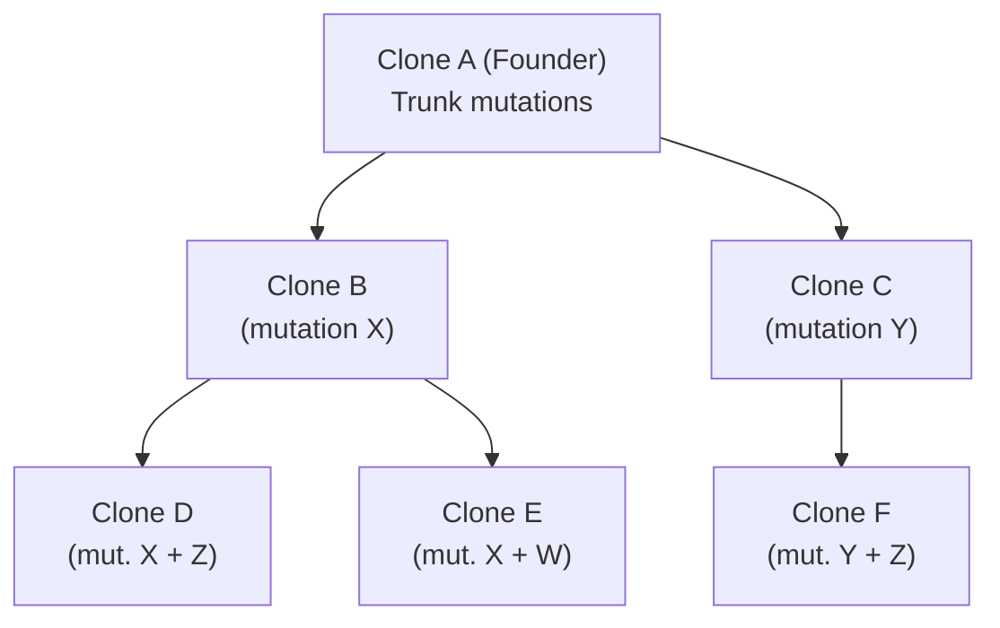
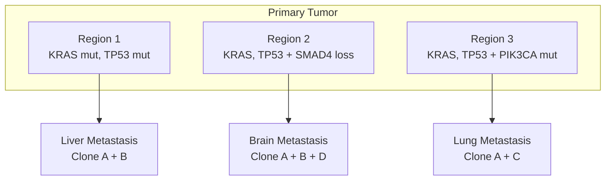

---
tags:
  - biology
  - cancer-biology
  - clonal-evolution
  - heterogeneity
  - cornell
aliases:
  - Clonal Evolution
  - Intratumor Heterogeneity
  - Spatial Heterogeneity
date: 2026-04-14
status: permanent
---
# Tumor Evolution and Heterogeneity

> [!ABSTRACT] Summary
> Tumors evolve like ecosystems, with clones competing under Darwinian selection. Four evolutionary models describe this process: linear evolution (early concept), branching evolution (most common, creates heterogeneity), punctuated evolution (catastrophic genomic events), and neutral evolution (no selection, passenger-driven). Spatial heterogeneity means different regions of the same tumor have different mutations, and temporal heterogeneity means the tumor changes under treatment pressure. This is why single biopsies are inadequate and why spatial transcriptomics and multi-region sampling are crucial.

---

## Cue Questions

> [!QUESTION] Key questions for self-testing
> - What are the four models of tumor evolution? Which is most common?
> - What is branching evolution, and why does it create intratumor heterogeneity?
> - What is punctuated evolution, and what genomic events cause it (chromothripsis, WGD)?
> - What is spatial heterogeneity, and why does a single biopsy miss it?
> - Explain temporal heterogeneity: why do resistant clones expand after treatment?
> - Why are liquid biopsies (ctDNA) valuable for monitoring temporal changes?
> - How does your research on spatial transcriptomics help resolve spatial heterogeneity?
> - What is the difference between a trunk mutation and a branch mutation?

---

## Notes

### 9.1 Clonal Evolution Models

#### Linear Evolution (Nowak Model)

```
Normal → Clone A → Clone B → Clone C → Clone D
         (founder)  (acquires    (acquires    (acquires
                     mutation X)  mutation Y)  mutation Z)
```

- Each successive clone **outcompetes** the previous
- Single dominant clone at any given time
- Early models of colorectal cancer (Vogelstein model)
- **Simplistic — rarely observed in reality**

---

#### Branching Evolution (Most Realistic)



- **Multiple subclones coexist simultaneously**
- Clinical consequence: **intratumor heterogeneity**
- Different parts of the tumor have different mutation profiles
- **This is the most common pattern observed**
- Trunk mutations (present in ALL clones) vs. branch mutations (present only in subclones)

---

#### Punctuated Evolution

- Normal cell → **macroevolutionary event** (chromothripsis, BFB cycles, whole genome doubling)
- Massively rearranged clone in a single catastrophic event
- Then: additional point mutations accumulate on top
- Fits observations where many rearrangements occur simultaneously (not gradual stepwise)

---

#### Neutral Evolution

- Many passenger mutations accumulate **without selection**
- Expanding population creates many subclones
- No single subclone has a selective advantage
- Predicts a specific distribution of variant allele frequencies
- Observed in some pediatric cancers and certain cancer types

---

### 9.2 Spatial Heterogeneity

Different regions of the same tumor have different mutation profiles:



**Clinical Implications:**
- Single biopsy may miss clinically relevant subclones
- Different metastases may respond differently to therapy
- This is why **spatial transcriptomics / multi-region sampling** matters
- Whole-cell segmentation + spatial mapping contributes to understanding spatial heterogeneity

---

### 9.3 Temporal Heterogeneity

**The selection-resistance cycle:**

| Stage | Clone Landscape | Clinical Status |
|---|---|---|
| **Pre-treatment** | Clones A, B, C coexist (B dominant) | Untreated cancer |
| **During treatment** | B is killed, C (resistant) expands | Initial response |
| **Post-treatment** | C is now dominant | Clinical relapse |
| **Next treatment** | Targets C, but clone D emerges | Second relapse |

> [!IMPORTANT] Clinical Relevance
> This is why **serial biopsies** and **liquid biopsies (ctDNA)** are important for monitoring treatment response. The tumor at relapse is genetically different from the tumor at diagnosis.

---

## Summary

> [!TIP] Cornell Summary
> Tumors evolve through branching evolution (most common), creating intratumor heterogeneity with multiple coexisting subclones. Spatial heterogeneity means a single biopsy is inherently inadequate — different tumor regions and metastases have different mutation profiles. Temporal heterogeneity means the tumor evolves under treatment pressure, with resistant clones expanding at relapse. Three approaches address this: multi-region sampling, liquid biopsies (ctDNA), and spatial transcriptomics. Your research on whole-cell segmentation and spatial mapping directly enables the characterization of spatial heterogeneity at single-cell resolution.

---

## Related

- [[Cancer Biology Reference Index]]
- [[Mutations and Genomic Alterations]]
- [[Hallmarks of Cancer]]
- [[Tumor Microenvironment]]
- [[Spatial Biology and Computational Pathology]]
- [[Cancer Biology MOC]]
