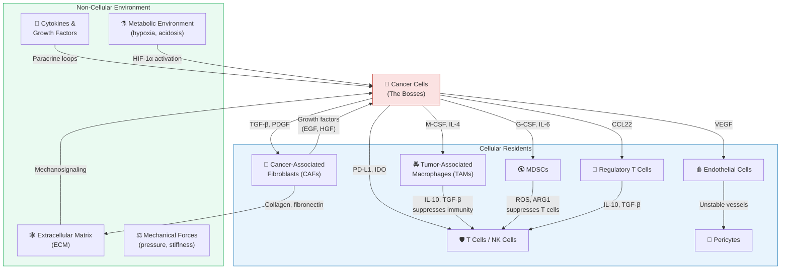
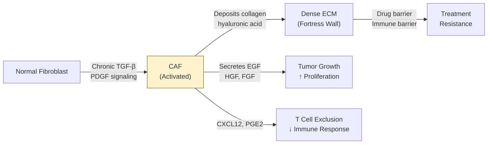
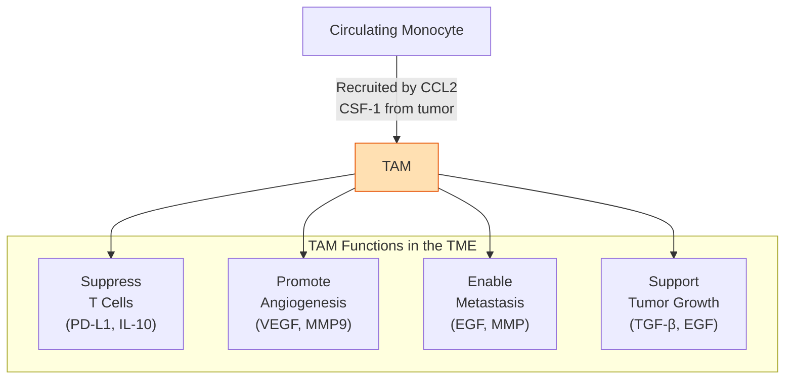
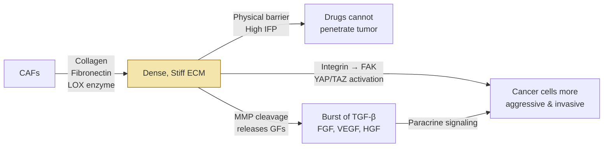
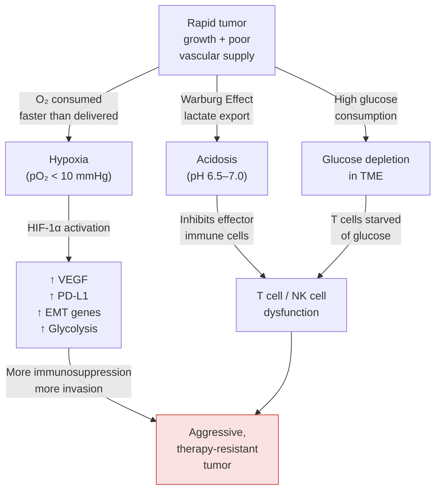
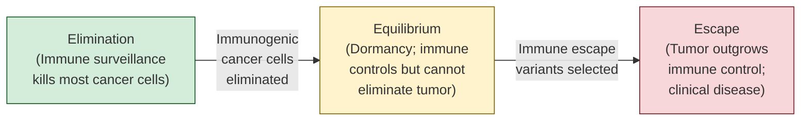
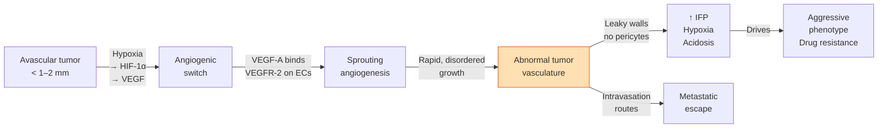
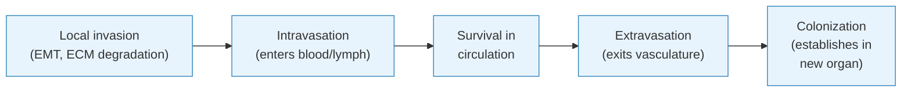

---
tags:
  - biology
  - cancer-biology
  - tumor-microenvironment
aliases:
  - TME
---
# The Tumor Microenvironment (TME)
### A Comprehensive Study Guide

> **Core concept:** A tumor is not a clump of rogue cells sitting quietly in your body — it is a living, dynamic, corrupted ecosystem. To understand cancer, you must understand the world the cancer cell builds around itself.

---

## Table of Contents

1. [What is the TME?](#1-what-is-the-tme)
2. [Overview: The TME at a Glance](#2-overview-the-tme-at-a-glance)
3. [The Cellular Residents](#3-the-cellular-residents)
   - [Cancer Cells](#31-cancer-cells)
   - [Cancer-Associated Fibroblasts (CAFs)](#32-cancer-associated-fibroblasts-cafs)
   - [Tumor-Associated Macrophages (TAMs)](#33-tumor-associated-macrophages-tams)
   - [T Lymphocytes and NK Cells](#34-t-lymphocytes-and-nk-cells)
   - [Myeloid-Derived Suppressor Cells (MDSCs)](#35-myeloid-derived-suppressor-cells-mdscs)
   - [Regulatory T Cells (Tregs)](#36-regulatory-t-cells-tregs)
   - [Endothelial Cells and Angiogenesis](#37-endothelial-cells-and-angiogenesis)
   - [Pericytes](#38-pericytes)
4. [The Non-Cellular Environment](#4-the-non-cellular-environment)
   - [Extracellular Matrix (ECM)](#41-extracellular-matrix-ecm)
   - [Signaling Molecules](#42-signaling-molecules)
   - [Mechanical Forces](#43-mechanical-forces)
   - [The Metabolic Environment](#44-the-metabolic-environment)
5. [Immune Evasion: How Tumors Escape Detection](#5-immune-evasion-how-tumors-escape-detection)
6. [Angiogenesis: Building a Blood Supply](#6-angiogenesis-building-a-blood-supply)
7. [The TME and Metastasis](#7-the-tme-and-metastasis)
8. [Therapeutic Targeting of the TME](#8-therapeutic-targeting-of-the-tme)
9. [The H&E Slide: Reading the TME Under the Microscope](#9-the-he-slide-reading-the-tme-under-the-microscope)
10. [Summary and Key Takeaways](#10-summary-and-key-takeaways)

---

## 1. What is the TME?

When you look at a cancer tumor under the microscope, the first instinct is to focus on the cancer cells — the large, abnormal, rapidly dividing cells that define the disease. But this instinct misses the bigger picture. The cancer cells account for only a *fraction* of the total cell population inside a tumor.

The **Tumor Microenvironment (TME)** is the entirety of the local ecosystem surrounding and infiltrating a tumor. It includes:

- All non-cancerous cell types (immune cells, fibroblasts, endothelial cells, pericytes)
- The structural scaffolding (the extracellular matrix)
- Blood and lymphatic vessels
- Signaling molecules, hormones, and metabolites
- Physical forces (pressure, stiffness, fluid dynamics)

What makes the TME remarkable — and dangerous — is that the cancer cells actively reshape this entire environment to serve their own survival. Normal, healthy cells are recruited, reprogrammed, or suppressed through an elaborate network of molecular signals. The result is a specialized habitat engineered for tumor growth, immune escape, and eventual spread.

The analogy of a **corrupt city** is apt: the cancer cells are the mob bosses, and they have methodically bribed the local police (immune cells), hired corrupt contractors (fibroblasts), bribed the city planners (endothelial cells to build leaky vessels), and created a physical infrastructure (stiff ECM) that makes it nearly impossible for law enforcement to operate.

Understanding this entire ecosystem — not just the cancer cell — is now the central challenge and the central opportunity in modern oncology.

---

## 2. Overview: The TME at a Glance

The following diagram shows the major components of the TME and how they interact. Each component is explored in detail in subsequent sections.

---

## 3. The Cellular Residents

### 3.1 Cancer Cells

**What they are:** Cancer cells are the founding and driving members of the TME — normal cells that have undergone somatic mutations in their DNA, disrupting the genes that control growth (proto-oncogenes become oncogenes), death (tumor suppressors are inactivated), and genome stability (DNA repair genes are lost).

**The hallmarks of cancer cells in the TME context:**
- They proliferate indefinitely, driven by self-sufficient growth signals
- They resist apoptosis (programmed cell death) and senescence
- They actively *remodel* their environment, secreting a constant stream of cytokines and growth factors to recruit and reprogram surrounding cells
- They compete metabolically with all other cells, consuming vast quantities of glucose and glutamine
- They evolve under selective pressure — harsh conditions (hypoxia, immune attack, chemotherapy) select for increasingly aggressive and drug-resistant subclones

**Intratumoral heterogeneity:** One critical concept is that a tumor is not a uniform mass of identical cancer cells. Through continuous mutation and selection, the cancer cell population becomes a diverse ecosystem of subclones, each with slightly different properties. Some subclones are more invasive, some more drug-resistant, some better at suppressing immunity. This heterogeneity is why tumors are so difficult to eradicate completely — killing 99.9% of cells may leave behind the most dangerous 0.1%.

---

### 3.2 Cancer-Associated Fibroblasts (CAFs)

**Normal fibroblast function:** Fibroblasts are the structural maintenance workers of connective tissue. Their primary job is to produce and organize the extracellular matrix — the scaffolding that holds tissues together. They are also critical in wound healing: when tissue is damaged, fibroblasts activate, proliferate, and lay down collagen to close the wound.

**Activation into CAFs:** Cancer cells exploit the wound-healing program. By continuously secreting **TGF-β** (transforming growth factor-beta) and **PDGF** (platelet-derived growth factor), they send a persistent "wound healing" alarm signal. Resident fibroblasts interpret this as injury and activate into CAFs — a state of chronic, never-resolving wound response.

**What CAFs do in the TME:**

| CAF Activity | Mechanism | Effect on Tumor |
|---|---|---|
| ECM remodeling | Secrete collagen I, III, fibronectin, hyaluronic acid | Creates a stiff, dense barrier around the tumor |
| Growth factor secretion | Produce EGF, HGF, FGF | Directly stimulates cancer cell proliferation |
| Immune modulation | Secrete CXCL12, produce CAF-derived exosomes | Excludes cytotoxic T cells from the tumor core |
| Metabolic support | Undergo "reverse Warburg," producing lactate and pyruvate | Fuel cancer cells oxidative metabolism |
| Drug resistance | Physical barrier + secretion of drug-metabolizing enzymes | Reduces drug penetration and concentration |

**CAF heterogeneity:** Not all CAFs are the same. Recent single-cell sequencing studies have identified multiple CAF subtypes with opposing roles. Myofibroblastic CAFs (myCAFs) build the dense collagen barrier, while inflammatory CAFs (iCAFs) produce immune-modulatory cytokines. This complexity has made CAF-targeting therapeutics challenging to develop.

---

### 3.3 Tumor-Associated Macrophages (TAMs)

**Normal macrophage function:** Macrophages are the professional phagocytes of the immune system — large cells that engulf and destroy pathogens, dead cells, and cellular debris. They also orchestrate inflammatory responses and direct tissue repair.

**The M1/M2 spectrum:** Macrophages exist on a functional spectrum between two poles:
- **M1 (classically activated):** Pro-inflammatory, anti-tumor. Kill bacteria and cancer cells, produce reactive oxygen species and cytotoxic cytokines (TNF-α, IL-12, IL-6).
- **M2 (alternatively activated):** Anti-inflammatory, pro-healing. Suppress inflammation, promote tissue repair, produce IL-10, TGF-β, and arginase.

The TME is a masterclass in macrophage manipulation. The tumor environment drives macrophage polarization away from M1 and toward an M2-like, tumor-promoting state. This is achieved through tumor-secreted signals including **IL-4, IL-13, IL-10, TGF-β, M-CSF,** and **VEGF**.

**What TAMs do in the TME:**

- **Suppress anti-tumor immunity:** TAMs produce IL-10 and TGF-β, which suppress cytotoxic T cell activity and promote regulatory T cell differentiation. They also express high levels of **PD-L1**, the immune checkpoint ligand that directly inactivates T cells.
- **Promote angiogenesis:** TAMs are among the richest sources of VEGF in the tumor, actively stimulating the formation of new, leaky blood vessels.
- **Support invasion and metastasis:** TAMs form "co-migration streams" with cancer cells at the tumor invasive front. They secrete **EGF**, which the cancer cells reciprocate with **CSF-1** — a paracrine loop that physically guides cancer cells toward blood vessels.
- **Remodel the ECM:** TAMs secrete matrix metalloproteinases (MMPs) that degrade ECM barriers, creating paths for cancer cell invasion.

**TAM density as a prognostic marker:** In most solid cancers (breast, lung, ovarian, hepatocellular), high TAM density correlates with poor prognosis — lower survival, more advanced stage, higher metastatic rate. This makes TAMs both a biomarker and a compelling therapeutic target.

---

### 3.4 T Lymphocytes and NK Cells

**The anti-tumor immune arsenal:** The adaptive immune system, primarily through **cytotoxic CD8+ T cells (CTLs)** and innate **Natural Killer (NK) cells**, is capable of recognizing and killing cancer cells. Understanding why this system fails inside the TME is the foundation of modern immunotherapy.

**How cytotoxic T cells normally work:**
1. A dendritic cell (DC) picks up tumor antigens (mutated protein fragments) and travels to the lymph node
2. The DC presents these antigens to naïve CD8+ T cells via MHC Class I
3. The T cell activates, proliferates, and migrates to the tumor
4. At the tumor, the CTL recognizes the antigen on the cancer cell surface and kills it via perforin/granzyme release

**Why this fails in the TME:**

The TME employs multiple parallel strategies to neutralize T cells. These are covered in depth in Section 5 (Immune Evasion), but the key mechanisms include:

- **T cell exclusion:** The dense ECM and CAF-secreted CXCL12 create physical and chemical barriers that prevent T cells from penetrating into the tumor core. T cells accumulate at the periphery (the "excluded" phenotype) but cannot reach the cancer cells.
- **T cell exhaustion:** Continuous antigen stimulation in the immunosuppressive TME environment drives T cells into a state of dysfunction called **exhaustion**, characterized by loss of effector function and upregulation of inhibitory receptors (PD-1, TIM-3, LAG-3, TIGIT).
- **Checkpoint pathway engagement:** Tumor cells express **PD-L1**, which binds PD-1 on T cells and delivers an inhibitory signal analogous to "show's over, stand down." This is a hijacking of a normal peripheral tolerance mechanism.

**NK cells:** Natural Killer cells provide a first line of anti-tumor defense that does not require prior sensitization — they can kill cancer cells without prior antigen presentation. The tumor suppresses NK cells by downregulating activating ligands (NKG2D ligands) and shedding these as decoys, and by upregulating inhibitory ligands (HLA-E, HLA-G) that mimic "self" signals.

---

### 3.5 Myeloid-Derived Suppressor Cells (MDSCs)

**What MDSCs are:** MDSCs are a heterogeneous population of immature myeloid cells — partially differentiated precursors of neutrophils, macrophages, and dendritic cells — that accumulate in the blood, lymph nodes, and tumor tissue of cancer patients. They are defined not by a specific lineage but by their potent ability to suppress T cell and NK cell function.

**Origin and recruitment:** In healthy individuals, myeloid precursors in the bone marrow differentiate properly into mature immune cells. In cancer, tumor-secreted cytokines (**G-CSF, GM-CSF, IL-6, VEGF, M-CSF**) cause an abnormal, massive expansion of these immature progenitors and simultaneously block their differentiation. The result is a flood of immunosuppressive cells into the circulation and the tumor.

**MDSCs suppress immunity through:**
- **Arginase-1 (ARG1):** Degrades arginine, an amino acid essential for T cell proliferation. T cells starved of arginine cannot divide.
- **iNOS and reactive oxygen/nitrogen species:** Nitric oxide and peroxynitrite damage T cell receptors and signaling proteins.
- **IDO (indoleamine 2,3-dioxygenase):** Depletes tryptophan (another essential T cell amino acid) and produces immunosuppressive kynurenine metabolites.
- **TGF-β and IL-10 secretion:** Soluble factors that directly inhibit T cell activation.
- **Expansion of Tregs:** MDSCs actively promote the differentiation and accumulation of Regulatory T cells.

**Clinical significance:** High circulating MDSC levels in cancer patients correlate with worse prognosis and poor response to immunotherapy. MDSC-targeting strategies (differentiation agents, selective depletion) are an active area of research.

---

### 3.6 Regulatory T Cells (Tregs)

**Normal function:** Regulatory T cells (CD4+CD25+FOXP3+) are the peacekeepers of the immune system. They prevent autoimmunity by suppressing excessive immune responses — they are essential for self-tolerance.

**Role in the TME:** Tumors exploit this normal tolerance mechanism. By secreting **CCL17, CCL22**, and **TGF-β**, tumors preferentially recruit Tregs from the periphery and promote their differentiation from naive CD4+ T cells within the tumor itself. Once there, Tregs shut down the very anti-tumor immune responses that could eliminate the cancer.

**Treg suppression mechanisms:**
- **CTLA-4:** Tregs constitutively express CTLA-4, which competes with CD28 on effector T cells for binding to B7 ligands on antigen-presenting cells, starving effector T cells of co-stimulatory signals
- **IL-2 consumption:** Tregs constitutively express the high-affinity IL-2 receptor (CD25), sequestering IL-2 that effector T cells need to survive and proliferate
- **IL-10 and TGF-β secretion:** Direct suppression of CTL function
- **Granzyme B/perforin:** Tregs can directly kill CTLs via these cytotoxic mechanisms — an ironic role reversal

**Treg density as biomarker:** High intratumoral Treg density correlates with poor prognosis in ovarian cancer, gastric cancer, and hepatocellular carcinoma. Depleting Tregs is an attractive therapeutic target, though systemic Treg depletion risks autoimmunity.

---

### 3.7 Endothelial Cells and Angiogenesis

Endothelial cells form the inner lining of all blood vessels — they are the architects of the vasculature. Their role in the TME is covered in depth in **Section 6**, but the key points are:

- Tumors beyond ~1–2 mm in diameter require their own blood supply and trigger a process called **angiogenesis** (the sprouting of new blood vessels)
- This is achieved primarily through tumor secretion of **VEGF** (Vascular Endothelial Growth Factor)
- Tumor-associated blood vessels are structurally and functionally abnormal: tortuous, leaky, inconsistently perfused, and prone to collapse
- This abnormal vasculature creates a hypoxic, acidic microenvironment and provides an escape route for metastasizing cancer cells

---

### 3.8 Pericytes

**Normal function:** Pericytes are stellate cells that wrap around small blood vessels (capillaries and venules), forming a structural sleeve that stabilizes the endothelial tube. They communicate with endothelial cells through **PDGF-B/PDGFRβ signaling** and regulate vessel tone, permeability, and blood flow.

**Role in the TME:** Tumor blood vessels have significantly fewer, more loosely attached pericytes than normal vessels. This is partly because the rapid, disordered angiogenesis driven by VEGF outpaces the normal recruitment of pericyte precursors, and because the tumor environment produces signals (high VEGF, low Ang1) that disrupt endothelial-pericyte interactions.

**Consequences of pericyte deficiency:**
- **Vascular leakiness:** Without pericyte stabilization, endothelial junctions are loose. Fluid and macromolecules leak into the tumor interstitium, elevating interstitial fluid pressure.
- **Poor perfusion:** Unstabilized vessels collapse irregularly, causing hypoxia to fluctuate across the tumor — cycling hypoxia that drives further mutagenesis.
- **Metastatic escape:** The leaky, unstable vessels provide easy entry points for intravasating cancer cells.

Some anti-angiogenic therapies that target only VEGF/VEGFR paradoxically worsen the situation by pruning even the few, relatively stable vessels, increasing hypoxia and driving more aggressive cancer behavior.

---

## 4. The Non-Cellular Environment

### 4.1 Extracellular Matrix (ECM)

**What the ECM is:** The extracellular matrix is the three-dimensional network of proteins and polysaccharides that fills the space between cells. It is far more than inert scaffolding — it is a dynamic, information-rich structure that stores growth factors, transmits mechanical signals, and actively directs cell behavior.

**Key ECM components:**
- **Collagens** (especially type I and III): The primary structural proteins, providing tensile strength
- **Fibronectin:** A glycoprotein that mediates cell adhesion and migration; markedly upregulated in the TME
- **Laminin:** A basement membrane component critical for epithelial organization
- **Hyaluronic acid (HA):** A glycosaminoglycan that fills the interstitial space; massively overproduced in many tumors
- **Proteoglycans (versican, perlecan):** Large glycoproteins that bind and store signaling molecules
- **Matrix metalloproteinases (MMPs):** Enzymes that degrade specific ECM components; both cancer cells and TAMs secrete MMPs to create invasion pathways

**ECM remodeling in the TME:**

In healthy tissue, the ECM is a soft, pliable network with a stiffness (Young's modulus) of roughly 0.1–2 kPa. In the TME, CAF-driven collagen deposition and crosslinking by lysyl oxidase (LOX) can raise tumor tissue stiffness to 5–20+ kPa — a 10–100-fold increase. This is why a doctor can often feel a breast tumor as a hard lump.

This stiffening has profound biological consequences:

1. **Mechanosignaling:** Cancer cells sense matrix stiffness through integrin receptors on their surface. Stiff matrices activate **FAK (Focal Adhesion Kinase)**, **Rho/ROCK pathways**, and ultimately **YAP/TAZ** transcription factors. The result: cancer cells become more proliferative, more invasive, and more resistant to apoptosis. The physical environment directly drives cancer biology.

2. **Growth factor reservoir:** The ECM serves as a sequestration depot for potent growth factors like **TGF-β, FGF, HGF**, and **VEGF** (bound to heparan sulfate chains). When MMPs cleave ECM components, these factors are released in a burst — a process called "ECM-mediated growth factor presentation." Cancer cells can essentially "mine" the ECM for growth signals.

3. **Therapeutic barrier:** The dense, crosslinked collagen network creates a physical barrier for drug delivery. Large molecules (antibodies, nanoparticles) are particularly impeded. The elevated interstitial fluid pressure pushes convective flow outward, away from the tumor center, actively expelling drugs.

---

### 4.2 Signaling Molecules

The TME is characterized by an extraordinarily dense and complex web of intercellular communication, mediated by:

**Cytokines:** Small signaling proteins that modulate immune cell activity and behavior. The TME cytokine landscape is dominated by immunosuppressive cytokines:
- **TGF-β:** Perhaps the most multifunctional TME cytokine. Suppresses T cell activation, drives CAF activation, promotes EMT (see Section 7), and stimulates ECM production.
- **IL-6:** Promotes cancer cell survival via JAK/STAT3 signaling; drives MDSC expansion; creates an acute-phase inflammatory state that suppresses anti-tumor immunity.
- **IL-10:** An anti-inflammatory cytokine that suppresses macrophage and T cell activity; produced by Tregs, TAMs, and directly by some cancer cells.
- **IL-4 / IL-13:** Drive M2 polarization of macrophages.

**Chemokines:** A subset of cytokines that direct cell migration along concentration gradients. Key TME chemokines include:
- **CXCL12 (SDF-1):** Secreted by CAFs; attracts immunosuppressive cells into the tumor and excludes cytotoxic T cells (CXCR4+ T cells are drawn to the stroma, not the tumor core)
- **CCL2 (MCP-1):** Recruits monocytes and TAM precursors from circulation into the tumor
- **CCL22:** Attracts CCR4+ Tregs into the tumor
- **CXCL5 / CXCL8 (IL-8):** Recruit MDSCs and promote angiogenesis

**Growth factors:** Proteins that stimulate proliferation and differentiation:
- **VEGF (Vascular Endothelial Growth Factor):** Drives angiogenesis; also acts as an immunosuppressive factor
- **EGF (Epidermal Growth Factor):** Potently stimulates cancer cell proliferation; part of the EGF–CSF-1 paracrine loop with TAMs
- **HGF (Hepatocyte Growth Factor):** Secreted by CAFs; activates MET receptor on cancer cells, driving invasion and EMT
- **FGF (Fibroblast Growth Factor):** Promotes angiogenesis and cancer cell survival; a key "rescue" pathway when VEGF is blocked therapeutically

**Exosomes:** Nano-sized membrane vesicles (30–150 nm) shed by all cells in the TME. Exosomes carry a cargo of proteins, lipids, mRNAs, and non-coding RNAs that reprogram recipient cells. Cancer cell–derived exosomes can train bone marrow progenitors to become MDSCs, pre-condition distant organ sites for metastasis (creating a "pre-metastatic niche"), and transfer drug resistance mechanisms between cells.

---

### 4.3 Mechanical Forces

The physical forces within a tumor are as important as the biochemical signals, yet they are often overlooked.

**Solid stress:** As cancer cells and CAF-produced ECM accumulate in a confined anatomical space, they generate compressive forces on surrounding structures. This "solid stress" can:
- Directly compress blood and lymphatic vessels, collapsing them and creating hypoxic zones
- Activate mechanosensory pathways (Piezo1/2 channels, integrin signaling) in cancer cells, pushing them toward a more aggressive phenotype
- Cause physical pain by compressing nerve fibers

**Interstitial fluid pressure (IFP):** In normal tissue, fluid leaking from capillaries is efficiently collected by the lymphatic system, maintaining a low, slightly negative interstitial pressure. Tumors have dysfunctional (or absent) lymphatics and highly permeable blood vessels, causing fluid to accumulate in the interstitium. IFP in tumors can reach 10–40 mmHg (compared to near-zero in normal tissue).

This elevated IFP has critical therapeutic implications:
- It eliminates the inward pressure gradient that would normally drive drugs from the vasculature into the tissue
- Fluid flow is directed outward, away from the tumor center, creating convective outflow that physically washes small-molecule drugs out before they can accumulate
- It contributes to lymphedema and promotes metastasis by pushing cancer cells into lymphatic vessels

**Matrix stiffness:** As discussed in the ECM section, the stiffened ECM serves as a sustained mechanosignal to cancer cells, continuously driving pro-survival and pro-invasive gene expression programs.

---

### 4.4 The Metabolic Environment

The TME creates a profoundly hostile metabolic environment that paradoxically benefits cancer cells while harming immune cells.

**The Warburg Effect and glucose competition:**
In 1924, Otto Warburg observed that cancer cells preferentially convert glucose to lactate even in the presence of adequate oxygen — a phenomenon now called **aerobic glycolysis** or the **Warburg Effect**. While energetically inefficient (glycolysis yields ~2 ATP per glucose vs. ~36 for oxidative phosphorylation), this strategy allows extremely rapid glucose consumption and provides carbon skeletons for biosynthesis.

The consequence: cancer cells deplete the local glucose supply, creating a glucose-poor TME. T cells and NK cells are heavily dependent on glucose for their effector functions — they, too, must undergo glycolysis to fuel their cytotoxic activities. Depriving them of glucose in the TME is a metabolic form of immune suppression.

**Lactate accumulation and acidosis:**
The product of aerobic glycolysis is lactate, exported from cancer cells along with protons by MCT (monocarboxylate transporter) proteins. This causes the TME to become **acidic** (pH 6.5–7.0, versus normal tissue pH of ~7.4).

Lactate and acidosis have multiple immunosuppressive effects:
- Acidic pH inhibits T cell and NK cell cytotoxic function
- Lactate directly inhibits T cell proliferation and activates ARG1 in macrophages, promoting M2 polarization
- Acidic conditions degrade IFN-γ (a key anti-tumor cytokine)
- Paradoxically, lactate can act as a fuel for cancer cells in oxidative metabolism and is avidly consumed by CAFs ("reverse Warburg")

**Hypoxia — the master regulator:**
Regions of low oxygen (hypoxia, pO₂ < 10 mmHg) arise in tumors due to poor vascular perfusion and high oxygen consumption. The key mediator is **HIF-1α (Hypoxia-Inducible Factor 1-alpha)**, a transcription factor that is normally rapidly degraded in the presence of oxygen. When oxygen is low, HIF-1α stabilizes and activates a broad transcriptional program:

| HIF-1α Target | Effect |
|---|---|
| VEGF | Stimulates angiogenesis |
| GLUT1, HK2 | Upregulates glycolysis |
| CA9 (carbonic anhydrase) | Acidifies the microenvironment |
| TWIST, SNAIL | Promotes EMT and invasion |
| PD-L1 | Directly upregulates immune checkpoint ligand |
| MDM2 | Suppresses p53-mediated apoptosis |
| CXCR4 | Increases chemokine receptor; promotes invasion |

The result: hypoxia doesn't just stress the cancer cell — it makes it stronger, more aggressive, and more immune evasive.

**Amino acid depletion:**
Beyond glucose, the TME becomes depleted in key amino acids:
- **Arginine:** Consumed by TAM/MDSC-expressed arginase-1; essential for T cell proliferation
- **Tryptophan:** Degraded by IDO1/IDO2 (expressed by tumor cells, MDSCs, and DCs); kynurenine metabolites suppress T cells and expand Tregs
- **Glutamine:** Heavily consumed by cancer cells; its depletion limits T cell oxidative metabolism

---

## 5. Immune Evasion: How Tumors Escape Detection

The immune system is, in principle, capable of detecting and destroying cancer. The process of **cancer immunoediting** describes the dynamic, evolving battle between the immune system and the tumor, occurring in three phases:

**Phase 1 — Elimination:** The immune system detects and destroys early cancer cells. Most cancer cells are eliminated before they ever form a clinically detectable tumor. This phase is why immunosuppressed individuals (transplant recipients, HIV patients) have markedly higher cancer rates.

**Phase 2 — Equilibrium:** Some cancer cells, through their inherent genetic instability, acquire mutations that allow them to persist despite immune pressure. They are not eliminated but are held in check — a state of dormancy that may last years or even decades. This explains why patients who receive a kidney transplant from a cancer-free donor can develop cancer from donor cells that were dormant for years.

**Phase 3 — Escape:** Further selection generates cancer cell variants that actively suppress or evade immune recognition, achieving a state of clinical disease. The TME is the primary arena of escape.

**Key immune evasion mechanisms:**

**1. Antigen loss:** Cancer cells downregulate or delete the mutant proteins (neoantigens) that T cells recognize. They can also downregulate or delete MHC Class I molecules, making them invisible to cytotoxic T cells. HLA loss is detected in up to 60% of tumors.

**2. PD-1/PD-L1 immune checkpoint axis:**
This is the most clinically important immune evasion mechanism. PD-1 is an inhibitory receptor expressed on activated T cells. Its ligand, **PD-L1**, is normally expressed on peripheral tissues to prevent autoimmunity (expressing "I'm normal, don't attack me"). Cancer cells hijack this mechanism:
- Tumor cells and TAMs express PD-L1 constitutively
- When PD-1 on a CTL binds PD-L1 on a cancer cell during the killing synapse, the CTL receives an inhibitory signal and disengages — literally the moment it is about to kill
- PD-L1 expression in tumors is further upregulated by IFN-γ (the very cytokine released by T cells trying to attack) — a negative feedback loop

**3. CTLA-4 checkpoint:**
CTLA-4 is expressed on activated T cells and Tregs. It competes with the stimulatory receptor CD28 for binding to B7 ligands on antigen-presenting cells. When CTLA-4 outcompetes CD28 (which it does due to higher affinity), the T cell receives a "stop" signal. Tregs exploit this to suppress effector T cells in lymph nodes, preventing tumor-reactive T cells from ever leaving to attack the tumor.

**4. IDO and metabolic suppression:**
As described above, IDO-mediated tryptophan depletion creates a metabolically hostile zone that preferentially cripples T and NK cells while leaving cancer cells relatively unaffected.

**5. T cell exhaustion:**
Chronic antigen stimulation in the immunosuppressive TME drives CTLs into an exhausted state. Exhausted T cells progressively lose:
- IL-2 production (→ cannot self-renew)
- TNF-α production
- IFN-γ production
- Cytotoxic killing capacity

And progressively gain:
- PD-1, TIM-3, LAG-3, TIGIT, and CTLA-4 expression (co-inhibitory receptors)

The transcription factor **TOX** is a master regulator of T cell exhaustion, driving an epigenetically stable dysfunctional state that is difficult to reverse even with checkpoint blockade.

**6. Physical exclusion:**
As noted, CAF-secreted CXCL12 and the dense ECM create a physical barrier that prevents T cells from penetrating the tumor core. The presence of T cells only in the tumor periphery ("immune-excluded" phenotype on biopsy) is a negative prognostic sign and correlates with poor response to PD-1 blockade.

---

## 6. Angiogenesis: Building a Blood Supply

### The angiogenic switch

A solid tumor can grow to approximately 1–2 mm in diameter (roughly 10⁶ cells) through passive diffusion of oxygen and nutrients. Beyond this size, the diffusion limit of oxygen (~200 μm) means that cells in the tumor core begin to die from hypoxia. To grow further, the tumor must recruit its own blood supply.

The **angiogenic switch** is the tipping point at which pro-angiogenic signals in the tumor overwhelm anti-angiogenic signals in the environment, triggering vessel sprouting. The primary driver is **VEGF-A**, produced by hypoxic cancer cells, TAMs, CAFs, and platelets.

### The VEGF pathway

VEGF (primarily VEGF-A, but also VEGF-C, VEGF-D, and PlGF) binds to **VEGFR-2** on endothelial cells, triggering:
- Endothelial cell proliferation and migration
- Upregulation of **Delta-like ligand 4 (DLL4)**, which guides tip cell specification via Notch signaling
- Destabilization of endothelial cell–pericyte interactions (loosening of pericyte grip)
- Degradation of the basement membrane by MMPs

### Tumor vascular abnormalities

Normal blood vessels are organized, hierarchically branched, and tightly controlled. Tumor blood vessels are:
- **Morphologically abnormal:** Tortuous, irregularly shaped, with abnormal branching
- **Structurally defective:** Lacking complete basement membranes, with loose endothelial junctions and reduced pericyte coverage
- **Functionally inadequate:** Intermittently perfused, highly permeable to macromolecules, unable to maintain consistent oxygen delivery
- **Immunologically permissive:** Tumor endothelial cells downregulate adhesion molecules (ICAM-1, VCAM-1) that T cells need for extravasation, while upregulating others (FasL, PD-L1) that kill or suppress T cells trying to enter

### Vascular normalization — a therapeutic paradox

The classical view was: cut off the blood supply to starve the tumor. Anti-VEGF drugs (bevacizumab, etc.) do reduce tumor vascularity but have shown modest overall survival benefits in most cancers. Why?

The **vascular normalization hypothesis** (Rakesh Jain, Harvard) proposes that optimal tumor treatment requires *normalizing* (not eliminating) tumor vessels — improving pericyte coverage, reducing permeability, decreasing IFP — to restore functional drug delivery and immune cell trafficking.

Low/moderate doses of anti-VEGF can achieve this normalization window, temporarily creating vessels that are more organized, less leaky, and more accessible to drugs and T cells. Above this dose range, excessive vessel pruning actually increases hypoxia and drives the tumor toward an even more aggressive, mesenchymal state.

---

## 7. The TME and Metastasis

Metastasis — the spread of cancer to distant organs — is responsible for ~90% of cancer deaths. The TME plays active roles at every step of the metastatic cascade.

### The metastatic cascade

### Step 1: Local invasion and EMT

For epithelial cancer cells to invade, they must break free from their epithelial neighbors and acquire migratory, mesenchymal properties. This process is called **Epithelial-to-Mesenchymal Transition (EMT)**.

EMT is driven by TME signals including TGF-β, HGF, EGF, and hypoxia, which activate transcription factors **SNAIL, TWIST, and ZEB1/2**. These factors:
- Repress E-cadherin (the "social glue" that holds epithelial cells together)
- Upregulate N-cadherin and vimentin (mesenchymal markers)
- Increase expression of ECM-degrading MMPs and invadopodia (specialized invasion structures)

The result is a cancer cell that has broken free from its epithelial constraints, acquired motility, and gained resistance to anoikis (cell death triggered by loss of anchorage).

CAFs and TAMs at the invasive tumor front actively participate:
- CAFs create **migration tracks** by aligning collagen fibers radially outward from the tumor — cancer cells follow these collagen "highways"
- TAMs form **TMEM (Tumor Microenvironment of Metastasis) doorways** — specific sites where a MENA-expressing cancer cell, a Tie2-high macrophage, and a permeable blood vessel are in contact, forming a high-efficiency intravasation hub

### Step 2–3: Intravasation and survival in circulation

Once a cancer cell enters the bloodstream, it becomes a **Circulating Tumor Cell (CTC)**. The vast majority of CTCs die within the circulation from:
- Shear stress from blood flow
- Anoikis (anchorage-independent death)
- NK cell and immune killing

Survival is enhanced by forming **microemboli** with platelets and other blood cells. Platelets coat CTCs, providing physical protection and transferring TGF-β and PDGF that promote a mesenchymal, anoikis-resistant state. Platelet-CTC clusters are highly metastatic.

### Step 4–5: Extravasation and colonization at the pre-metastatic niche

Organs where cancer will colonize are not passive recipients — they are **pre-conditioned** by systemic factors from the primary tumor before metastatic cells arrive. This pre-conditioning creates the **pre-metastatic niche**.

Key pre-metastatic niche factors:
- **Tumor-derived exosomes** home to specific organs (integrins on exosome surfaces determine organ tropism) and reprogram resident stromal and immune cells
- **Bone marrow-derived myeloid progenitors (BMDPs)** are mobilized by tumor-secreted factors and colonize the future metastatic site, expressing S100A8/A9 and creating an immunosuppressive, pro-adhesive environment
- **VEGFR1+ hematopoietic progenitor cells** cluster at fibronectin-rich foci in target organs before CTCs arrive

The famous "seed and soil" hypothesis of Paget (1889) — that cancer cells preferentially metastasize to organs whose microenvironment is hospitable — is essentially a proto-description of the pre-metastatic niche concept.

---

## 8. Therapeutic Targeting of the TME

The recognition that the TME is essential for tumor survival, immune evasion, and metastasis has opened a second front in cancer therapy — targeting not the cancer cell itself, but its ecosystem.

### 8.1 Anti-angiogenic therapy

**Mechanism:** Inhibiting VEGF or VEGFR to cut off the tumor blood supply.

**Key agents:**
- **Bevacizumab (Avastin):** Monoclonal antibody that sequesters VEGF-A; approved in colorectal, lung, breast, ovarian cancers
- **Sorafenib, Sunitinib, Axitinib:** Multi-kinase inhibitors targeting VEGFR, PDGFR; used in renal cell carcinoma, hepatocellular carcinoma
- **Ramucirumab:** Anti-VEGFR2 antibody

**Limitations:** Tumors escape anti-VEGF therapy by upregulating alternative angiogenic pathways (FGF, PDGF, Angiopoietin-2). The vascular normalization window is narrow and transient.

### 8.2 Immune checkpoint inhibitors (ICIs)

The most transformative TME-directed therapy in the last decade. ICIs release the brakes that tumors place on T cells.

**Approved classes:**
- **Anti-PD-1:** Pembrolizumab (Keytruda), Nivolumab (Opdivo) — block T cell exhaustion; approved in melanoma, NSCLC, MSI-H tumors, and many others
- **Anti-PD-L1:** Atezolizumab, Durvalumab, Avelumab — block tumor-expressed PD-L1
- **Anti-CTLA-4:** Ipilimumab (Yervoy) — blocks Treg suppression and restores T cell priming in lymph nodes

**Combination therapy:** Anti-PD-1 + anti-CTLA-4 (nivolumab + ipilimumab) is superior to either alone in melanoma and lung cancer, as they act at different checkpoints (priming phase vs. effector phase).

**Biomarkers of response:**
- **PD-L1 IHC score:** Higher PD-L1 expression on tumor cells correlates with better response (but is not sufficient)
- **TMB (Tumor Mutational Burden):** More mutations = more neoantigens = more T cell targets; high TMB predicts ICI response across tumor types
- **MSI-H / dMMR:** Deficient mismatch repair leads to thousands of somatic mutations; the most reliable predictor of ICI benefit (pembrolizumab is approved pan-tumor for dMMR)
- **TIL density (CD8+ score):** Inflamed ("hot") tumors respond better than excluded or desert phenotypes

**Limitations:** Only ~20–30% of patients respond to current ICIs. Primary resistance can involve immune exclusion, T cell exhaustion, antigen loss, or β2M deletion. Autoimmune side effects can be severe.

### 8.3 CAR-T cell therapy

**Mechanism:** Patient T cells are genetically engineered to express Chimeric Antigen Receptors (CARs) — synthetic receptors that direct T cell killing toward a tumor antigen independent of MHC. The engineered cells are expanded ex vivo and infused back.

**Success in hematologic malignancies:** CAR-T therapy targeting CD19 (B-ALL, DLBCL) and BCMA (multiple myeloma) has produced remarkable, durable responses in some patients with refractory disease.

**Challenges in solid tumors:** The TME presents enormous obstacles to CAR-T therapy in solid tumors:
- T cell trafficking and infiltration are blocked by the dense ECM and CAF-secreted chemokine barriers
- The immunosuppressive TME (Tregs, MDSCs, IDO, acidosis, glucose depletion) exhausts CAR-T cells rapidly
- Tumor antigen heterogeneity means targeting one antigen leads to outgrowth of antigen-negative escape variants
- On-target/off-tumor toxicity (antigens shared with normal tissues) is a safety concern

Current strategies to overcome TME resistance include arming CAR-T cells to secrete their own cytokines (IL-15, IL-21), combining with checkpoint inhibitors, and engineering CAR-T cells with armored domains that resist suppression.

### 8.4 Targeting the ECM and CAFs

**Rationale:** Dissolving or softening the ECM fortress to improve drug penetration and immune cell access.

**Approaches in development:**
- **Pegvorhyaluronidase alfa (PEGPH20):** Enzyme that degrades hyaluronic acid in the tumor stroma; improves drug delivery in pancreatic cancer (hyaluronic acid is extremely abundant in pancreatic ductal adenocarcinoma)
- **Losartan:** AT1R antagonist (an antihypertensive) that reduces collagen and hyaluronic acid production; shown to normalize IFP and improve drug delivery in clinical trials
- **LOX/LOXL2 inhibitors:** Block collagen crosslinking, preventing ECM stiffening
- **FAP-targeted therapies:** Fibroblast Activation Protein (FAP) is highly expressed by myCAFs; FAP-targeted antibodies, CAR-T cells, and radiopharmaceuticals are in trials

### 8.5 Macrophage reprogramming

**Rationale:** Flip TAMs from M2-like (pro-tumor) to M1-like (anti-tumor) states.

**Approaches:**
- **Anti-CD47 (Magrolimab):** CD47 is a "don't eat me" signal expressed on cancer cells; blocking it allows macrophages to phagocytose tumors. In trials for AML and solid tumors.
- **CSF-1R inhibitors:** Block the M-CSF receptor that drives monocyte recruitment and M2 differentiation; deplete or reprogram TAMs. PLX5622, Pexidartinib.
- **TLR agonists:** Activate innate PRRs in macrophages to drive M1 polarization
- **PI3Kγ inhibitors:** PI3Kγ is a key signal transduction node for M2 polarization; inhibition shifts macrophages toward M1 and restores anti-tumor immunity

### 8.6 Combination strategies and the future

Single-agent TME therapies have shown limited efficacy, as the TME is highly redundant — blocking one pathway is compensated by others. Rational combinations are the future:

- **ICI + anti-VEGF:** Vascular normalization improves T cell trafficking; ICI restores T cell function. FDA-approved combinations include atezolizumab + bevacizumab (hepatocellular carcinoma).
- **ICI + chemotherapy:** Chemo induces immunogenic cell death (ICD), releasing tumor antigens and danger signals that prime the immune response, potentially making "cold" tumors "hot" before ICI.
- **ICI + ECM targeting:** Breaking down the T cell exclusion barrier to allow checkpoint-reinvigorated T cells to access the tumor core.
- **ICI + metabolic targeting:** IDO inhibitors (to restore tryptophan) or MCT inhibitors (to reduce lactate/acidosis) being combined with PD-1 blockade in trials.

---

## 9. The H&E Slide: Reading the TME Under the Microscope

A Hematoxylin and Eosin (H&E) stained tissue section gives a pathologist a simultaneous window into both the cancer cells and the TME. Learning to read the TME on an H&E slide is fundamental to understanding tumor biology and prognosis.

**What the stains show:**
- **Hematoxylin (purple/blue):** Stains nucleic acids — nuclei appear dark purple; the density and irregularity of nuclear staining shows cell density and proliferation
- **Eosin (pink/red):** Stains proteins — cytoplasm and ECM appear pink; a dense pink acellular area between cells is collagen-rich ECM (the CAF-built barrier)

**TME features visible on H&E:**

| H&E Feature | What You're Seeing | Significance |
|---|---|---|
| Dense pink stroma surrounding tumor nests | Collagen-rich ECM deposited by CAFs | Desmoplastic reaction; poor drug/immune access |
| Small lymphocytes within tumor (TILs) | Tumor-Infiltrating Lymphocytes | High TIL = better prognosis; hot tumor |
| Lymphocytes at periphery only, not in tumor | Immune-excluded phenotype | Resistance to ICI |
| Large pale cytoplasm cells with kidney-shaped nuclei | Macrophages (TAMs) | High TAM density → poor prognosis in most cancers |
| Necrotic zones (ghost cells, nuclear debris) | Hypoxic cell death | Evidence of poor perfusion; aggressive tumor |
| Cells at invasive front with elongated shape | Cells undergoing EMT | Invasive front; higher metastatic potential |
| Lymphovascular invasion (cancer cells in vessel lumen) | Intravasation | Active metastatic spread; poor prognosis |

**Going beyond H&E:** Modern pathology increasingly layers additional techniques onto H&E:
- **IHC (Immunohistochemistry):** Antibody staining for specific proteins (PD-L1, CD8, FOXP3, CD68) to quantify immune cells and checkpoint expression
- **Multiplex IHC / mIF:** Simultaneously detect 5–8 markers, revealing the spatial relationships between different cell types
- **Spatial transcriptomics:** Map the gene expression of every cell in a tissue section, revealing transcriptional heterogeneity across the TME in situ
- **Digital pathology / AI:** Algorithms that can quantify TIL density, predict TMB from morphology, and classify immune phenotype from whole-slide images

---

## 10. Summary and Key Takeaways

### The TME is a co-opted ecosystem, not a passive bystander

Cancer cells do not simply grow faster than normal cells. They build and maintain an entire ecosystem — recruiting allies, suppressing enemies, building infrastructure, and creating a metabolic landscape uniquely hostile to anything that might threaten them. This ecosystem is the Tumor Microenvironment.

### The cellular cast

| Cell Type | Corruption Summary | Net Effect |
|---|---|---|
| **Cancer cells** | Driver; secretes signals to reprogram all others | Proliferation, invasion, immune evasion |
| **CAFs** | Wound-healing gone wrong | ECM fortress, growth factors, T cell exclusion |
| **TAMs** | Corrupt police in M2 state | Immune suppression, angiogenesis, metastasis |
| **T cells / NK** | Exhausted or excluded | Failed anti-tumor immunity |
| **MDSCs** | Immature myeloid flood | Potent T cell suppression, Treg expansion |
| **Tregs** | Peacekeepers protecting the wrong side | Shut down anti-tumor T cells |
| **Endothelial cells** | Building leaky, chaotic supply lines | Hypoxia, metastatic routes |
| **Pericytes** | Absent or loosely attached | Vascular instability, IFP, metastasis |

### The non-cellular landscape

The stiff ECM, elevated IFP, hypoxia, acidosis, and depleted nutrient environment work together to:
1. Protect the tumor from immune attack
2. Block drug delivery
3. Drive cancer cells toward more aggressive, treatment-resistant phenotypes

### Targeting the TME is the future

Understanding the TME has shifted the field from a cancer-cell-centric view to an ecosystem view. The most exciting therapeutic advances of the last decade — immune checkpoint inhibitors, anti-angiogenics, CAR-T cells — all target the TME rather than the cancer cell directly. Durable cures will likely require combination strategies that simultaneously address multiple layers of the ecosystem.

---

*Study notes compiled for educational purposes. For clinical decisions, consult current primary literature and clinical guidelines.*

---

## Related

- [[Cancer Biology MOC]]
- [[Cancer Biology - Comprehensive Reference for Computational Pathology]]
- [[Digital Pathology MOC]]
- [[Computational Pathology MOC]]
