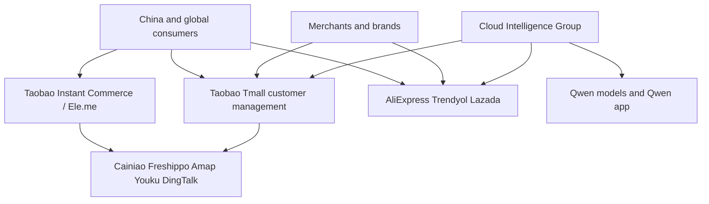

# Alibaba Group Holding Ltd (BABA)

Alibaba is the company that taught a generation that China commerce could print cash without holding inventory. The last five fiscal years show something different: sales recovered after a FY2023 dip, then FY2026 operating profit collapsed while reported net income barely budged. NYSE ticker **BABA** is an American depositary share. Each ADS represents eight ordinary shares (Hong Kong: 9988). Dual-primary listing on HKEX and NYSE as of August 28, 2024. Fiscal year ends March 31. As of the packet date, the ADS last price is **$108.56** and market cap is **$269.84B** (Yahoo, Medium). Trailing P/E in the tables is **18.0x** from market cap over FY2026 net income. Do not divide the ADS price by filing EPS of $0.80; that $0.80 is per ordinary share, not per ADS.

## Quick scorecard

Qualitative `Read` is a view. Numbers live in `tables.md`.

| What I am looking at | Read (view) |
| :--- | :--- |
| Sales recovered: $126.5B (FY2023) → $148.4B (FY2026), +8.1% last year | Growth is back, but it is not a boom |
| Operating margin 14.1% → 4.9% in one year | The machine was opened and money was poured into quick commerce and AI |
| Net income $17.93B → $15.02B | Earnings quality is the story. Investment gains held the bottom line up |
| Operating cash flow $22.53B → $11.05B | Cash from the business halved. That is the number that worries me |
| Capex / FCF in the ledger | unknown (XBRL capex tag missing). See harvested 20-F capex below |
| Cash $19.07B, total debt $32.01B, net debt $12.94B | Cash-only net debt. Short-term investments are not in this net-debt figure |
| Trailing P/E 18.0x; Yahoo forward P/E 11.7x (Medium) | Not expensive if FY2026 earnings quality were clean. It is not clean |
| TTM revenue / TTM net income | unknown (no quarterly packet; Alibaba files 20-F, not 10-Q) |

![[tables]]

## Figures

The cash-vs-capex and FCF-vs-capex plots cannot show a capex series because the ledger capex row is unknown. Do not read those two figures as “capex is zero.”

## Claims

**Claim:** FY2026 operating profit fell because Alibaba spent to buy quick-commerce engagement and AI capacity, not because sales disappeared.
**Confidence:** high.
FY2026 revenue was $148.40B versus $137.30B in FY2025. Operating income fell from $19.42B to $7.27B. The opened 20-F (accession `0001193125-26-231755`) says income from operations decreased 64% from RMB140,905 million to RMB50,150 million (US$7,270 million), “primarily attributable to the decrease in adjusted EBITA and increase in impairment of goodwill.” Alibaba China E-commerce Group adjusted EBITA fell 44% to RMB107,509 million (US$15,586 million) “primarily due to the investment in quick commerce, user experiences, and technology, while there is positive contribution from customer management service.” All others adjusted EBITA was a loss of RMB35,737 million (US$5,181 million) versus a loss of RMB9,499 million, “primarily due to the increased investment in technology businesses.”

**Claim:** FY2026 net income is a poor proxy for the operating machine because mark-to-market investment gains more than replaced the operating drop.
**Confidence:** high.
Interest and investment income, net was RMB87,512 million (US$12,687 million) in FY2026 versus RMB20,759 million in FY2025, “primarily due to the year-over-year increase in net gain from mark-to-market changes of our equity investments, as well as net gains from disposal of investment[s].” Operating cash flow still fell to $11.05B. The cash-flow note says FY2026 operating cash “primarily consisted of net income of RMB102,127 million (US$14,805 million), as adjusted for non-cash items,” including “gain related to equity securities and other investments of RMB66,089 million (US$9,581 million).” That is the competing picture to “earnings only dipped a little.”

**Claim:** Cloud is the one segment that accelerated on both sales and profit in FY2026.
**Confidence:** high for the year in the 20-F; mixed that this is a permanent step-up rather than an AI-capex cycle.
Cloud Intelligence Group revenue was RMB158,132 million (US$22,924 million), up 34% from RMB118,028 million. “Overall revenue excluding Alibaba-consolidated subsidiaries increased by 33% year-over-year, primarily driven by public cloud revenue growth, including the increasing adoption of AI-related products.” Adjusted EBITA rose 35% to RMB14,265 million (US$2,068 million). The same filing says AI-related products accounted for 30% of a 40% external-revenue acceleration in the final quarter of fiscal 2026. That last figure is a management KPI in the 20-F narrative, not a separately audited cloud-AI revenue line.

## Business / segment / AI layers

The CLI could not extract a segment grid into `tables.md`. The numbers below are from the opened FY2026 20-F HTML tables (RMB millions, years ended March 31). They are filing facts, not ledger rows.

| Segment (filing labels) | FY2024 revenue | FY2025 revenue | FY2026 revenue | FY2026 adj. EBITA |
| :--- | ---: | ---: | ---: | ---: |
| Alibaba China E-commerce Group | 490,101 | 508,380 | 554,217 | 107,509 |
| of which customer management | 307,950 | 326,769 | 343,867 | (see group) |
| of which quick commerce | 50,852 | 53,588 | 78,520 | (see group) |
| Alibaba International Digital Commerce Group | 102,598 | 132,300 | 144,170 | (2,051) |
| Cloud Intelligence Group | 106,374 | 118,028 | 158,132 | 14,265 |
| All others | 317,539 | 338,347 | 254,367 | (35,737) |
| Consolidated revenue | 941,168 | 996,347 | 1,023,670 | n/a |

China e-commerce is still the cash engine. Customer management (ads and commissions on Taobao and Tmall) kept growing. Quick commerce — Ele.me rebranded to Taobao Instant Commerce in FY2026 — is the new spend. That is where the 44% EBITA drop lives. International (AliExpress, Trendyol, Lazada) is still loss-making, but the loss shrank from RMB15,137 million to RMB2,051 million (US$297 million) “primarily due to significant improvement in AliExpress’ operating efficiency.”

Cloud is the second machine. IaaS, PaaS, and MaaS. The filing calls Alibaba China’s largest public-cloud provider by 2025 revenue, citing IDC. I treat that IDC ranking as Medium until I open the IDC tracker; the company’s own Cloud revenue and EBITA are High.

All others is a leftover pile: Freshippo, Cainiao, Alibaba Health, Hujing Digital Media and Entertainment, Amap, Qwen Consumer Business Group, Lingxi Games, DingTalk. FY2026 revenue fell 25% “primarily due to the revenue decrease as a result of the disposal of Sun Art and Intime businesses, as well as the decrease in revenue from Cainiao.” Do not read the All others sales drop as the core marketplace shrinking.

Harvested KPI candidates I am willing to keep, with accession `0001193125-26-231755`:

- “In March 2026, consumer-facing Qwen has surpassed 295 million monthly active users across all platforms.” Medium. MAU is not revenue.
- “In fiscal years 2024, 2025 and 2026, our capital expenditures totaled RMB32,087 million, RMB85,972 million and RMB126,063 million (US$18,275 million), respectively.” High as a 20-F statement; still not a ledger capex row because the XBRL tag was missing.
- “For fiscal year 2026, we declared a regular cash dividend in the amount of US$0.13125 per Share or US$1.05 per ADS for a total amount of US$2.5 billion.” High.
- “During the year ended March 31, 2026, … we repurchased a total of 73 million Shares on the NYSE for an aggregate consideration of US$1.0 billion.” High. That is a slow year versus the authorized program (upsized by US$25.0 billion in February 2024 through March 2027).
- “As of March 31, 2026, these restricted net assets totaled RMB344.6 billion (US$50.0 billion).” High. A large slice of China-subsidiary equity is not freely upstreamed.

## Competing explanation

The bull case is that FY2026 is a deliberate step-function: buy local-services density against Meituan, and buy AI/cloud share while Qwen is hot, then margins recover. The competing explanation is that this is a cycle, not a step-up.

Quick commerce subsidies can become the new cost of remaining the China shopping super-app. If Meituan and others match spend, China e-commerce adjusted EBITA does not return to RMB193 billion. Cloud growth can be GPU hours that customers rent while they train models, then normalize. The filing itself flags the risk: “we are making significant investments in cloud computing and artificial intelligence (AI) … There also can be no assurance that we may effectively monetize our AI capabilities.”

A second competing explanation for “cheap earnings”: FY2026 net income includes a huge investment-gain year. If those marks reverse, trailing P/E of 18.0x is not the earnings power you think you bought. Operating cash flow already told on that.

China policy is not a side note. The same 20-F restates the April 10, 2021 SAMR fine of RMB18.2 billion for exclusive-dealing and the multi-year rectification. VIE structure, cybersecurity review, and restricted net assets stay on the table. I take that bear case seriously.

## Capex, cash, and capital intensity

Ledger capex and FCF are **unknown**. I will not invent them.

The opened 20-F states FY2026 capital expenditures of RMB126,063 million (US$18,275 million), up from RMB85,972 million in FY2025 and RMB32,087 million in FY2024, “primarily in relation to (i) the acquisition of computer equipment and construction of data centers relating to our Cloud business …; (ii) the acquisition of infrastructure for logistics services and direct sales businesses; and (iii) … corporate campuses.” Capital commitments contracted but not provided for were RMB54,136 million (US$7,848 million) at March 31, 2026.

If I subtract that harvested capex from ledger operating cash flow of $11.05B, FY2026 free cash flow would be negative. I am not putting that derived figure in the ledger. It is a teaching calculation from two High sources that do not share a tagged capex series.

Cash and cash equivalents fell from $34.37B (FY2024) to $19.07B (FY2026). Total debt rose to $32.01B. The company flipped from net cash to net debt on a cash-only definition. Debt/EBIT jumped to 4.4x because EBIT collapsed; Debt/EBITDA stayed 0.8x. Interest coverage fell from 14.7x to 5.1x. Working capital compressed from $45.89B (FY2024) to $19.48B. R&D rose to $9.64B. D&A jumped from $24.52B to $34.96B, consistent with the cloud build and with impairments sitting near operating income.

Balance-sheet comfort is real on EBITDA and still real versus many levered cyclicals. Comfort is not the same as “cash generation is fine this year.”

## Valuation caveats

Trailing P/E of **18.0x** uses market cap / FY2026 net income. That is the right way to avoid the ADS-versus-ordinary-share trap. Yahoo **forward P/E 11.7x** is Medium and methodologically opaque.

Do not use diluted EPS of $0.80 against the $108.56 ADS price. Filing EPS is per Share. Eight Shares sit under each ADS. Yahoo `shares_outstanding` of about 2.49B is an ADS count; the ledger diluted share count of 19.23B is ordinary shares.

FY2026 net income is inflated by non-operating investment gains (US$12.687 billion of interest and investment income, net). Trailing earnings are therefore easier than the operating business. P/B is 1.8x on $153.80B of book equity. That multiple is not a quality stamp; a lot of that book is inside China with restricted net assets of US$50.0 billion.

## Peer context

Nearby names, not a second report. **PDD** is the take-rate and value-commerce pressure on Taobao. **JD** is the 1P / logistics comparison for direct sales. **Meituan** is the competitor that makes the quick-commerce EBITA drop intelligible. **Amazon** is the cloud-scale comparison: Alibaba Cloud FY2026 revenue of US$22.9 billion is a serious business and still a fraction of Amazon’s cloud machine. I am not scoring those peers here.

## Category scores (view)

| Category | Score (view) |
| :--- | :--- |
| China marketplace distribution | 8 / 10 |
| Quick commerce / local services | 4 / 10 |
| Cloud and AI stack | 7 / 10 |
| International commerce | 5 / 10 |
| Earnings quality (FY2026) | 3 / 10 |
| Balance sheet (cash-only net debt vs EBITDA) | 7 / 10 |
| Capital return (buybacks slowed; regular dividend kept) | 5 / 10 |
| China policy / VIE / trapped capital | 4 / 10 |

No probability-the-stock-works score.

## Investable / holdable / buyable (view)

**Investable:** yes. Large, liquid, dual-listed. The ledger is thick enough to study.

**Holdable:** yes if you already own it and can sit through a multi-year spend cycle in quick commerce and cloud. The core customer-management line is still growing.

**Buyable at $108.56:** no, as a view. The multiple looks friendly because FY2026 net income is not the operating story, operating cash halved, and the 20-F capex figure implies FCF stress I cannot even put in the ledger. I want evidence the China e-commerce EBITA trough is in before adding risk.

## When the view changes

**More bullish if:** China E-commerce Group adjusted EBITA stops falling and starts climbing back from RMB107.5 billion without another year of 4.9% consolidated operating margin; operating cash flow moves back toward the $20B+ zone of FY2022–FY2025; Cloud revenue stays in the 25%+ growth band with adjusted EBITA still rising; buybacks re-accelerate against the remaining authorization.

**More worried if:** another fiscal year prints operating margin near 5% with OCF stuck near $11B; harvested capex stays near US$18B while cloud growth decelerates; investment-income marks reverse and net income falls harder than operations; quick-commerce subsidies show up as a permanent take-rate war; a new SAMR or data-security action hits the VIE perimeter.

## What to watch next

Two numbers: **China E-commerce Group adjusted EBITA** and **operating cash flow**. Cloud revenue growth is the third, not the first. Next print after the May 20, 2026 20-F is unknown in this snapshot (no 6-K was fetched). I will not guess the date.

## Sources

- SEC companyfacts / ledger FY2022–FY2026: accessions `0001104659-22-082622`, `0000950170-23-033752`, `0000950170-24-063767`, `0000950170-25-090161`, `0001193125-26-231755` (High).
- Form 20-F filed 2026-05-20, accession `0001193125-26-231755`, HTML at `data/companies/BABA/raw/20260911T031638Z/filings/10k.html` (High for company-reported figures; Medium for MAU, IDC ranking, and “AI-related products” mix).
- Yahoo / yfinance price, market cap, ADS share count, forward P/E as of 2026-09-11 (Medium).
- CLI tables and plots: `doc/companies/BABA/tables.md`, `doc/companies/BABA/ledger.json`, `doc/companies/BABA/plots/`.

## View

- **Lean**: Hold. This is a view, not an established fact.
- I respect the cloud acceleration and the still-large China marketplace. I do not pay 18x for a year when operating cash halved, operating margin fell to 4.9%, and net income was carried by investment marks. The cheap-looking forward P/E is Yahoo Medium. Prove the EBITA trough, then the lean can move.
