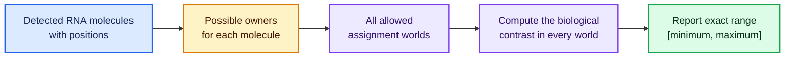
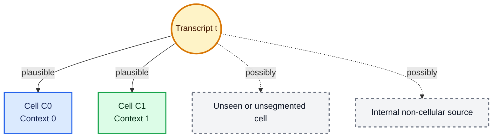
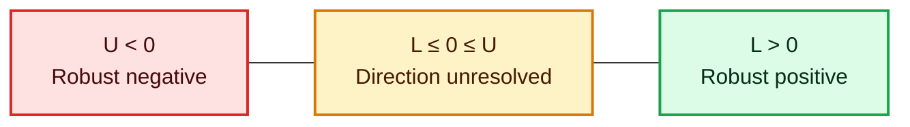
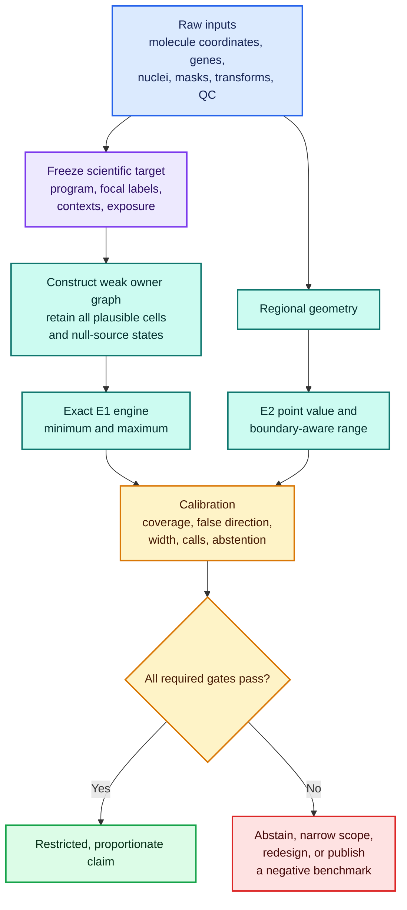
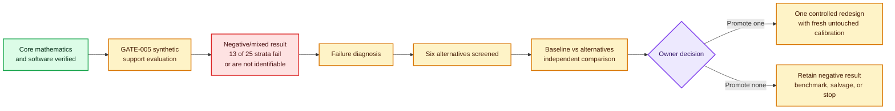
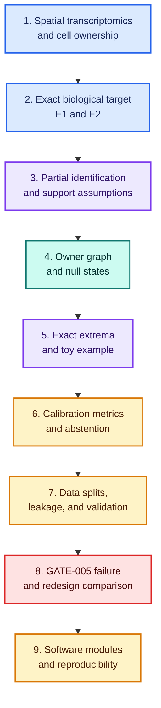

# CellBound — High-Level Project Overview

> [!abstract] The project in one sentence
> **CellBound asks whether a biological conclusion remains true even when we are uncertain about which cell owns each detected RNA molecule.**

> [!important] Current scientific position
> The project is currently **methods-first**. It is developing and testing the uncertainty method itself.  
> It is **not currently authorized to make a biological discovery claim**.

---

## 1. The problem CellBound is trying to solve

Imaging-based spatial transcriptomics measures individual RNA molecules inside a tissue section.

For each detected molecule, we usually know:

- which gene it represents;
- its approximate \(x,y\) position;
- sometimes its localization uncertainty;
- nearby nuclei, cell masks, stains, and tissue boundaries.

But we often do **not** know with certainty which cell produced that molecule.

This becomes difficult near:

- cell boundaries;
- tightly packed cells;
- irregular or elongated cells;
- missing or damaged nuclei;
- overlapping cells;
- weak membrane staining;
- extracellular or background signal.

Most analysis pipelines make one final assignment:

```text
RNA molecule → one chosen cell
```

That creates one cell-by-gene count matrix. Downstream analysis then acts as though that assignment were known.

CellBound takes a different approach:

```text
RNA molecule → all scientifically plausible owners
```

It then asks:

> Across every allowed assignment, what is the smallest and largest value the biological comparison could take?

The result is an **interval**, not one supposedly exact answer.

---

## 2. The central mental model

Imagine that every RNA molecule is a letter found on the floor between several apartments.

A standard method picks one apartment and delivers the letter there.

CellBound first asks which apartments could reasonably own the letter. It then calculates the scientific result under every allowed delivery pattern.

The aim is not to reconstruct one perfect ownership map.

The aim is to determine whether the scientific conclusion is **stable to ownership uncertainty**.



---

## 3. A visual example of ambiguous ownership

Suppose one transcript lies close to two cells.



The arrows form part of an **owner graph**.

- A transcript is one type of node.
- A possible owner is another type of node.
- An edge means: “this owner is allowed for this transcript.”
- The graph does not say that every edge is equally likely.
- It says that the edge has not been safely ruled out.

> [!warning] The crucial assumption
> CellBound can protect the scientific result only when the transcript’s **true owner is included among its allowed owners**.  
> If the graph leaves out the true owner, the computed interval can miss the true answer.

---

## 4. What CellBound actually measures

CellBound focuses on a prespecified comparison involving:

1. a **gene program** — a frozen weighted group of genes;
2. a **focal cell population** — the cell type of interest;
3. two **contexts** — for example, near versus far from another cell population;
4. a fixed normalization or **exposure**.

A possible question is:

> Is the detected repair-ligand program attributed to macrophages higher when the macrophages are near inflammatory fibroblasts than when they are far away?

The question, genes, labels, contexts, and thresholds must be chosen **before looking at the target result**.

That prevents the method from being tuned until it produces a preferred answer.

---

## 5. E1: the cell-attributed uncertainty interval

The first main output is called **Estimand 1**, or **E1**.

An **estimand** is the exact quantity a study is trying to estimate.

For each allowed assignment world \(w\), CellBound calculates a contrast:

\[
\theta_F(w)
=
\text{program mass per focal cell in context 1}
-
\text{program mass per focal cell in context 0}
\]

It then finds:

\[
L=\min_w \theta_F(w),
\qquad
U=\max_w \theta_F(w)
\]


where:

- \(w\) is one allowed transcript-assignment world;
- \(\theta_F(w)\) is the contrast in that world;
- \(L\) is the smallest possible contrast;
- \(U\) is the largest possible contrast;
- \([L,U]\) is the exact graph-compatible interval.

### How to read the interval



| Interval | Meaning |
|---|---|
| \(L>0\) | Every allowed assignment gives a positive contrast. |
| \(U<0\) | Every allowed assignment gives a negative contrast. |
| \(L\le 0\le U\) | Plausible assignments disagree about the direction. |
| Very wide interval | The current evidence does not localize the answer well. |
| Narrow interval | Ownership ambiguity has less effect on this particular contrast. |

> [!note] What “robust” means here
> “Robust positive” does not mean causally positive or biologically proven.  
> It means positive under every assignment allowed by the stated graph and assumptions.

---

## 6. Why the minimum and maximum can be computed exactly

The E1 contrast is linear: every transcript contributes a fixed amount depending on which allowed owner receives it.

For one transcript, CellBound can calculate the contribution under each allowed owner.

It then chooses:

- the smallest allowed contribution when constructing the lower bound;
- the largest allowed contribution when constructing the upper bound.

Because transcripts are not coupled by a shared capacity constraint in the core formulation, this can be done one transcript at a time.

```text
Lower bound = sum of each transcript's smallest allowed contribution
Upper bound = sum of each transcript's largest allowed contribution
```

This avoids sampling only a few assignment worlds. It calculates the exact extrema over the declared graph.

> [!example]- Five-transcript toy result
> In the frozen toy example, the weak owner graph produces:
>
> \[
> [L_W,U_W]=[-3,2]
> \]
>
> The interval crosses zero, so direction is unresolved.
>
> A separately calibrated morphology rule removes one implausible edge and produces:
>
> \[
> [L_M,U_M]=[-1,2]
> \]
>
> The interval becomes narrower, but it still crosses zero.  
> The additional image evidence improves precision but does not justify a directional claim.

---

## 7. E2: the regional companion

The second main output is **Estimand 2**, or **E2**.

E2 avoids assigning transcripts to individual cells. It compares program density directly between two tissue regions:

\[
\theta_R
=
\frac{\text{program mass in region 1}}{\text{area of region 1}}
-
\frac{\text{program mass in region 0}}{\text{area of region 0}}
\]

E2 answers:

> Is the gene program regionally denser in one context than the other?

It does **not** answer:

> Which cell type produced the molecules?

That distinction is essential.

| Output | Main question |
|---|---|
| E1 | Can the contrast be attributed to the focal cells despite ownership ambiguity? |
| E2 | Is there a regional program-density difference without cell attribution? |

E2 also accounts for uncertainty in transcript coordinates and region boundaries. A molecule near a regional border may be allowed to contribute to either region or to outside support.

> [!warning] Do not substitute E2 for E1
> A positive regional signal can be caused by different cell composition, extracellular RNA, neighboring cells, or detection differences.  
> It cannot by itself prove that the focal cells produced the signal.

---

## 8. The complete CellBound pipeline



---

## 9. The important null-owner states

CellBound does not force every molecule into a detected cell.

It can include special possible sources:

| State | Plain meaning |
|---|---|
| Detected cell | A visible candidate cell may own the transcript. |
| \(b_{off}\) | Off-tissue signal or assay artifact may explain it. |
| \(b_{in}\) | Internal non-cellular, extracellular, or artifact signal may explain it. |
| \(u\) | A real cell without a usable detected nucleus may own it. |

These states make the graph more honest. They also make intervals wider.

That is a deliberate trade-off:

> A narrow interval is not useful if it becomes narrow by silently excluding plausible truth.

---

## 10. Calibration: testing whether the uncertainty method is trustworthy

An interval can be mathematically exact for its graph and still fail scientifically if the graph is wrong.

CellBound therefore tests the method on held-out truth regimes.

### Main calibration ideas

| Metric | Question |
|---|---|
| Coverage | How often does the interval contain the known target? |
| False direction | How often does CellBound make a directional call with the wrong sign? |
| Conditional false direction | Among directional calls, how many are wrong? |
| Width | How informative is the interval? |
| Call rate | How often does the interval exclude zero? |
| Abstention | How often does the method refuse to answer? |
| Owner support | How often does the graph include the true owner? |

The intended safety target includes approximately:

- nominal 95% coverage;
- lower 95% confidence bound for coverage at least 90%;
- upper 95% confidence bound for false direction at most 5%;
- adequate call counts and useful interval width.

These checks must pass in every mandatory calibration stratum, not only on average.

> [!danger] Safety–informativeness trade-off
> A graph that includes almost every possible owner may be safe but produce intervals too wide to use.  
> A graph that removes many owners may produce narrow intervals but exclude truth.  
> The main scientific problem is finding a defensible balance.

---

## 11. Validation without perfect ground truth

No single validation source answers every question.

CellBound keeps several evidence regimes separate:

| Evidence regime | What it can support |
|---|---|
| Fully synthetic data | Coverage under a known simulator world |
| Semi-synthetic data | Response to controlled realistic perturbations |
| Manual, membrane, or 3D subsets | Whether detected true-owner edges are retained in annotated cases |
| Orthogonal assay or section | Whether an outcome replicates |
| Real public data | Practical behavior, failure modes, and transport limits |

A manual boundary is not perfect truth. An orthogonal protein assay usually does not prove molecule ownership. A simulator proves behavior only under the simulator’s assumptions.

The project therefore avoids merging all evidence into one fictional “gold standard.”

---

## 12. What CellBound is not trying to do

> [!failure] Explicit non-goals
> CellBound is not trying to:
>
> - discover the universally correct cell segmentation;
> - reconstruct one uniquely true cell-by-gene matrix;
> - make a causal claim;
> - select genes after inspecting the target result;
> - claim that regional E2 evidence proves focal-cell E1 attribution;
> - generalize beyond platforms, tissues, or morphologies that passed calibration;
> - call a segmentation method or vendor assignment “ground truth.”

---

## 13. Current project status

> [!warning] Status snapshot from the supplied project context
> The active path is a **methods-only challenge at GATE-005**.

### What has been established

- The core E1 and E2 mathematical definitions have been frozen.
- Exact E1 and E2 software modules and their validation tests have been developed.
- The schema, coordinates, graph, simulator, evaluation, design, and execution machinery passed extensive independent software review.
- The project formally pivoted away from the initial biological-candidate route.
- No biological candidate is selected.
- No biological outcome is authorized.

### What failed

The accepted GATE-005 synthetic result was **negative/mixed**:

- 25 mandatory strata were tested;
- 13 strata failed or were not identifiable on at least one frozen numeric criterion;
- therefore the current `core-weak` graph cannot pass GATE-005.

This is not merely a software failure. The software executed the frozen test and produced evidence that the current graph design is not sufficiently supported across the required regimes.

### What happens next

Six redesign alternatives have been screened, but none is yet promoted.

The next decision is to compare:

```text
accepted baseline
        versus
six screened alternatives
```

Then the owner must choose between:

1. promoting one redesign for a single controlled implementation attempt; or
2. retaining the negative support result and narrowing the project to a benchmark, salvage, or negative-result contribution.



> [!important] Correct interpretation
> The negative result is scientifically useful. It shows where the current assumptions and graph construction fail.  
> It must not be hidden, tuned away using protected outcomes, or bypassed by selecting only the passing strata.

---

## 14. The most important ideas to understand first

### Priority 1 — The biological measurement problem

Focus on:

- what imaging-based spatial transcriptomics measures;
- why RNA positions are not the same as cell ownership;
- how segmentation errors affect cell-level expression;
- why boundary molecules are especially ambiguous;
- the difference between molecule detection error and ownership error.

**Goal:** Be able to explain why a clean-looking cell mask is not automatically truth.

---

### Priority 2 — The scientific target or estimand

Focus on:

- gene programs and weights;
- focal cells;
- context 0 and context 1;
- the exposure denominator;
- what the E1 contrast means biologically;
- what it does not mean.

**Goal:** Write the biological question as one precise contrast before discussing algorithms.

---

### Priority 3 — Partial identification

**Partial identification** means the evidence does not determine one exact target value, but it can restrict the target to a set or interval.

Focus on:

- why \([L,U]\) is a set of compatible values;
- the difference between an exact graph range and a biological identified interval;
- why support assumptions are required;
- why calibration tests assumptions but cannot prove them for every new specimen.

**Goal:** Explain why uncertainty can be represented honestly without forcing a probability distribution or one point estimate.

---

### Priority 4 — Owner-graph construction

Focus on:

- transcript uncertainty regions \(Q_t\);
- cell reach from nuclei;
- detected-cell edges;
- off-tissue, internal-noncellular, and unseen-cell states;
- empty rows and abstention;
- graph signatures;
- why target genes and target signs are forbidden inputs to graph construction.

**Goal:** Understand that graph quality is the main scientific bottleneck.

---

### Priority 5 — Exact E1 computation

Focus on:

- how each possible owner gives a transcript a coefficient;
- why context-1 focal ownership is positive;
- why context-0 focal ownership is negative;
- why non-focal and null ownership may contribute zero;
- why row-wise minima and maxima produce exact endpoints;
- monotonicity: adding edges cannot narrow the interval.

**Goal:** Reproduce the five-transcript toy by hand and in code.

---

### Priority 6 — E2 and spatial boundary uncertainty

Focus on:

- region-level density rather than cell attribution;
- valid tissue area;
- localization ellipses;
- region membership near boundaries;
- mask erosion and dilation;
- why E2 can disagree with E1.

**Goal:** Explain exactly what conclusion E2 permits.

---

### Priority 7 — Calibration and selective claims

Focus on:

- coverage;
- unconditional false direction;
- conditional false direction;
- call rate;
- normalized width;
- risk–coverage curves;
- abstention;
- stratum-specific evaluation.

**Goal:** Understand why a method can look safe simply by making almost no calls, and why both safety and usefulness must be reported.

---

### Priority 8 — Experimental separation and data leakage

Focus on the separation of:

- development data;
- calibration data;
- module-safety data;
- estimand-test data;
- biological-test data;
- external-validation data.

Also focus on:

- donor-level splitting;
- freezing programs and thresholds;
- evidence-reuse ledgers;
- why the same evidence cannot build and validate the same component.

**Goal:** Be able to detect a circular or outcome-driven analysis.

---

### Priority 9 — Simulation design

Focus on how the simulator varies:

- cell packing and morphology;
- missing nuclei;
- partial cells and tissue borders;
- registration error;
- localization error;
- background and unseen cells;
- context-dependent detection;
- label error;
- correlated segmentation errors;
- donor heterogeneity.

**Goal:** Understand why success on one easy simulator does not establish general safety.

---

### Priority 10 — The present GATE-005 challenge

Focus on:

- why the current `core-weak` graph failed;
- the difference between software correctness and method performance;
- the aggregate failure signatures and mechanism classes;
- scientific floors for accepting an alternative;
- the protected-outcome firewall;
- fresh untouched calibration after any promoted redesign;
- the finite stop rule.

**Goal:** Be able to judge whether a redesign changes the real scientific mechanism or only hides the failure.

---

## 15. Recommended learning order



---

## 16. A practical depth roadmap

### Level A — Conceptual understanding

- [ ] Explain the ownership problem without using equations.
- [ ] Explain why one segmentation is not truth.
- [ ] Explain the difference between E1 and E2.
- [ ] Interpret positive, negative, and zero-crossing intervals.
- [ ] Explain why abstention can be the correct output.
- [ ] Explain the current GATE-005 result accurately.

### Level B — Mathematical understanding

- [ ] Define every symbol in E1.
- [ ] Derive transcript-level coefficients.
- [ ] Reproduce the \([-3,2]\) toy interval.
- [ ] Prove why adding an allowed edge cannot narrow the interval.
- [ ] Explain the graph-support assumption.
- [ ] Derive the boundary-aware E2 range.
- [ ] Distinguish finite-cohort intervals from sampling confidence intervals.

### Level C — Statistical understanding

- [ ] Calculate coverage from calibration replicates.
- [ ] Calculate false-direction events.
- [ ] Explain unconditional versus conditional false direction.
- [ ] Interpret Clopper–Pearson bounds.
- [ ] Explain donor as the independent biological unit.
- [ ] Explain why fields from one donor are not independent donors.
- [ ] Understand the donor-level max-\(t\) bootstrap contract.

### Level D — Implementation understanding

- [ ] Read and validate transcript, cell, edge, program, region, and specimen schemas.
- [ ] Trace coordinates and units through the pipeline.
- [ ] Build a tiny weak owner graph.
- [ ] Run the E1 engine on a hand-checkable example.
- [ ] Run E2 on a boundary-crossing example.
- [ ] Test empty rows and abstention.
- [ ] Test graph nesting and monotonicity.
- [ ] Compare exact enumeration with the row-wise engine.

### Level E — Scientific review

- [ ] Separate planned work from accepted evidence.
- [ ] Identify which claims require graph support.
- [ ] Identify which claims require label reliability.
- [ ] Identify which claims require donor-level replication.
- [ ] Check whether an alternative passes all scientific floors.
- [ ] Check whether protected outcomes influenced redesign.
- [ ] Decide whether a negative-result benchmark remains publishable and useful.

---

## 17. Questions you should be able to answer

1. What uncertainty remains after an RNA molecule has been detected correctly?
2. Why is a hard cell assignment not the same as biological truth?
3. What exactly is the E1 contrast?
4. Why can E1 produce an interval instead of a point?
5. What must be true for the E1 interval to contain the biological target?
6. Why does a zero-crossing interval mean “unresolved,” not “no effect”?
7. Why can a regional E2 result not prove focal-cell attribution?
8. What is gained and lost by adding null-owner states?
9. How can a morphology module narrow an interval?
10. How can the same module make the method unsafe?
11. Why are coverage and false direction evaluated separately?
12. Why must calibration pass in every mandatory stratum?
13. Why can a method with very low call rate appear artificially safe?
14. Why must development and test donors be separated?
15. What did RESULT-033 show?
16. Why does software verification not imply scientific success?
17. What evidence would justify promoting a redesign?
18. When is retaining a negative result the correct scientific decision?

---

## 18. Key misconceptions to avoid

| Misconception | Replacement mental model |
|---|---|
| “The nearest cell owns the transcript.” | The nearest cell is one candidate, not necessarily the source. |
| “A good-looking segmentation is ground truth.” | Segmentation is an inferred model output. |
| “The interval is a confidence interval.” | First, it is an exact range over allowed assignment worlds. Sampling uncertainty is a separate layer. |
| “Crossing zero means there is no effect.” | It means the sign is not stable under the allowed uncertainty. |
| “E2 validates E1.” | E2 is regional evidence and does not identify the producing cell type. |
| “Calibration proves the assumption.” | Calibration measures past performance in declared domains; it cannot logically prove support in every new specimen. |
| “More image evidence is always better.” | Edge deletion is useful only if it safely removes false owners without deleting true owners. |
| “Passing tests means the method works scientifically.” | Tests establish implementation correctness; performance gates establish scientific adequacy. |
| “A failed gate should be tuned until it passes.” | A failed frozen gate is evidence. Redesign must be controlled and tested on fresh untouched data. |

---

## 19. Software map to study later

| Module | Main purpose |
|---|---|
| `schemas.py` | Defines and validates data structures. |
| `coordinates.py` | Handles coordinate systems, units, and transformations. |
| `estimand.py` | Computes exact E1 interval endpoints. |
| `regional.py` | Computes E2 and its boundary-aware range. |
| `graph/weak.py` | Builds the conservative core weak owner graph. |
| simulation components | Create known truth and controlled failure regimes. |
| calibration components | Measure coverage, errors, calls, widths, and abstention. |
| reporting components | Preserve provenance and generate claim-limited outputs. |

A useful first code exercise is:

```text
five transcripts
→ hand-written allowed-owner edges
→ exact coefficient rows
→ E1 lower and upper endpoints
→ exhaustive enumeration check
```

---

## 20. Suggested source-reading path

1. `[[sources/cellbound_final_project_blueprint|Final project blueprint]]`
   - Read sections on the overview, exact estimands, assumption ladder, graph construction, toy example, validation, and risks.

2. `[[sources/cellbound_implementation_plan|Implementation plan]]`
   - Read the decision flow, phases 1–7, gate table, and first sprint.

3. `[[sources/cellbound_operating_state|Operating state]]`
   - Use this for the latest accepted status. Do not infer status from chat or old plans.

4. `[[sources/gate005/TASK-030_return|GATE-005 synthetic result]]`
   - Understand what was tested and why the result is negative/mixed.

5. `[[sources/gate005/TASK-031_failure_mechanism_summary|Failure-mechanism summary]]`
   - Study the observed signatures and unresolved mechanisms.

6. `[[sources/gate005/TASK-033_baseline_alternatives_comparison|Baseline-versus-alternatives comparison]]`
   - This is the immediate decision surface.

7. Core code:
   - `src/cellbound/estimand.py`
   - `src/cellbound/regional.py`
   - `src/cellbound/graph/weak.py`
   - related tests

---

## 21. Final compressed summary

> [!summary]
> **Problem:** We detect RNA molecules but may not know which cell produced them.  
> **Standard shortcut:** Choose one assignment and ignore that uncertainty.  
> **CellBound approach:** Keep all defensible owners, calculate every compatible value of a frozen contrast, and report the exact minimum and maximum.  
> **E1:** Cell-attributed contrast interval.  
> **E2:** Assignment-free regional density companion.  
> **Safety requirement:** The true owner must be included in the graph, and calibration must pass in the declared domain.  
> **Correct output may be:** positive, negative, unresolved, or abstain.  
> **Current state:** Core mathematics and software are well tested, but the current weak graph failed GATE-005 support in 13 of 25 mandatory strata. Six alternatives are screened. The next step is an independent comparison followed by an owner decision to promote one redesign or retain the negative result.

---

## Source basis

This learning note was synthesized from the supplied `CELLBOUND_TEACHER_CONTEXT.md` pack, especially its embedded authoritative project map, final blueprint, implementation plan, operating-state snapshot, GATE-005 records, and core software-module descriptions.

> [!note] Status hygiene
> This note is a learning overview, not the canonical project ledger.  
> For any later status change, verify `sources/cellbound_operating_state.md` and the accepted decision/result records.
